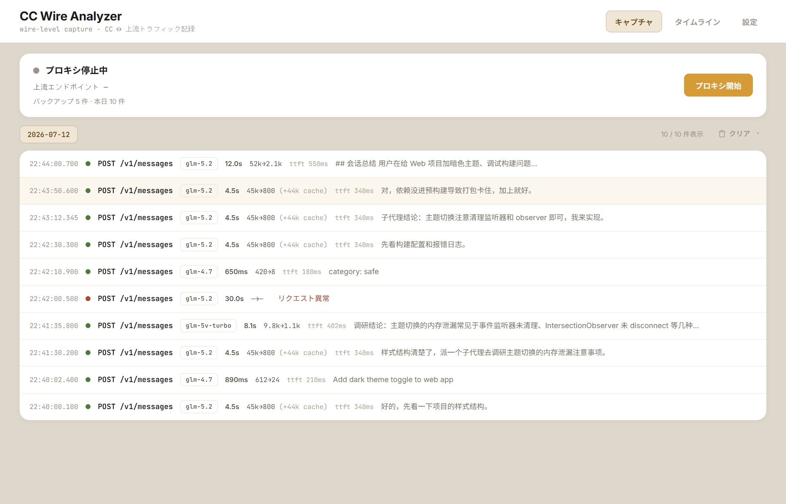
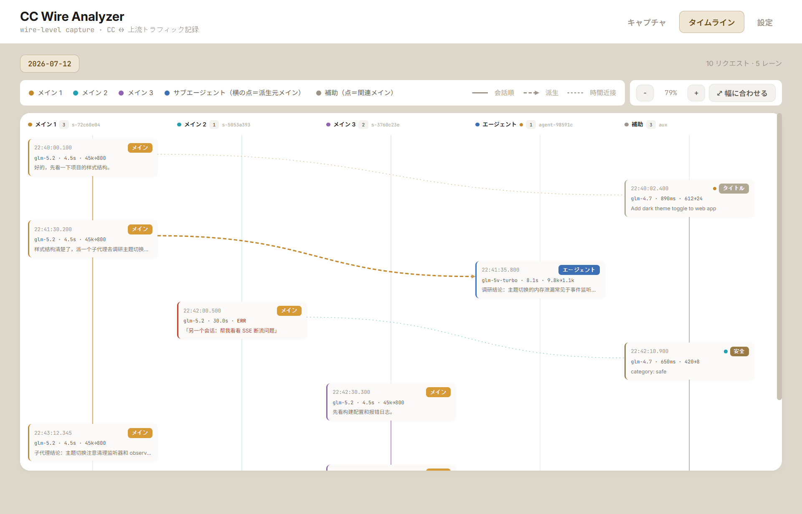
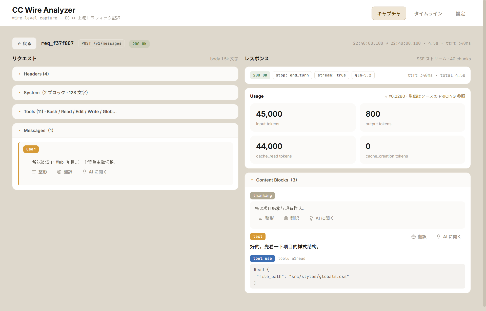
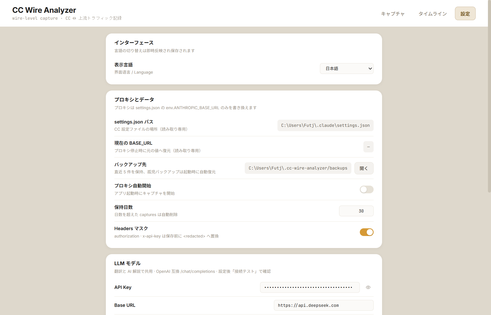

# CC Wire Analyzer

Claude Code と上流エンドポイント間の全 HTTP トラフィックを透過的に**完全録画**するローカル MITM プロキシのデスクトップアプリ——`~/.claude/projects/*.jsonl`（CC の後処理済みビュー）や OTLP テレメトリでは見えないリンクレベルの次元を補います。

[English](README.md) · [中文](README.zh.md)

## 他では見えないものが見える

Claude Code が上流（Anthropic 公式またはサードパーティのゲートウェイ）と通信する際、送出リクエストには jsonl/OTLP では捕捉できないリンクレベルの真実が隠れています：システムプロンプト内の生のウォーターマークフィールド、SSE チャンクのタイミング、上流の正確なレスポンス、セキュリティ分類器の呼び出し、正確なトークンコスト。本ツールはローカルプロキシを立ち上げ、CC の `ANTHROPIC_BASE_URL` を一時的にそこへ向け、全トラフィックを**録画しながら転送**します——これらの真実を観測可能にします。

## スクリーンショット

| キャプチャ一覧 | タイムライン DAG |
|---|---|
|  |  |

| リクエスト詳細 | 設定 |
|---|---|
|  |  |

## 主な機能

- **非侵入** —— `~/.claude/settings.json` の `ANTHROPIC_BASE_URL` だけを編集。トークン、モデルマッピング、OTLP 設定は全保持。アプリ終了時にバイト級で復元します。
- **公式直通・サードパーティ両対応** —— `ANTHROPIC_BASE_URL` なし（Anthropic へ直通）でも動作、公式エンドポイントのキャプチャにフォールバック。設定されていればそれに従います（例：[cc-switch](https://github.com/farion1231/cc-switch) で設定したゲートウェイ）。
- **透過ストリーミング** —— SSE を録画しながら転送。CC にとって直通と全く同じ感覚です。
- **クラッシュ保護** —— 原子書き込み + 起動ごとのバックアップ + atexit/signal/excepthook の三重復元 + 孤児バックアップ復元。
- **タイムライン DAG** —— スイムレーンビュー。各メインセッションはレーンヘッダー、軸、ノード枠線、エッジに独自の色を持ちます。サブエージェント/補助ノードは関連セッションの色の点を持ち、何が何を派生したかが一目で分かります。
- **詳細ツール** —— 翻訳、「これが何を意味するか AI に聞く」（プロンプト注入ガード付き）、整形/プリティプリント。UI は**中国語/英語/日本語**切り替え対応（即時・永続化）。
- **録画クリア** —— その日のキャプチャを消去（直接削除 / zip 書庫化してから削除）、インライン二段階確認付き。
- **クロスプラットフォーム** —— Windows `.exe` と macOS `.app`、GitHub Actions でビルド。**フォント同梱**（Inter + JetBrains Mono + Noto Sans SC）で、どのマシンでも同じ見た目。

## クイックスタート

### 方法 A —— リリースビルドをダウンロード

[Releases](../../releases) から最新の `cc-wire-analyzer-windows.exe` または `CCWireAnalyzer-mac.zip` を取得。Python は不要。

- **Windows**：`.exe` をダブルクリック。WebView2 不足を警告されたら [Microsoft Edge WebView2 Runtime](https://developer.microsoft.com/microsoft-edge/webview2/) をインストール。
- **macOS**：解凍し、`CCWireAnalyzer.app` を `/Applications` にドラッグ。アプリは**未署名・未公証**（無料 OSS プロジェクトの標準——署名は年 $99 かかります）のため、**初回起動は Gatekeeper にブロックされます**。一度だけ許可してください：
  - `CCWireAnalyzer.app` を右クリック →「開く」→ダイアログで「開く」を確認、**または**
  - 新しい macOS で上記が出ない場合：**システム設定 → プライバシーとセキュリティ → 下部の「このまま開く」**をクリック。
  - 初回許可後は通常通り開き、以降プロンプトは出ません。（Apple のセキュリティ措置であり、アプリの不具合ではありません。）

### 方法 B —— ソースから実行

```bash
git clone <this-repo> && cd cc-wire-analyzer
uv sync                 # Windows
uv sync --extra mac     # macOS（pyobjc をインストール）
uv run python src/desktop.py
```

アプリ内で**プロキシ開始**をクリックし、新しい Claude Code セッションを開いて普通に使う——トラフィックがキャプチャ一覧に現れます。

## 仕組み（30 秒版）

1. **プロキシ開始**をクリック。
2. アプリが `~/.claude/settings.json` をバックアップし、`ANTHROPIC_BASE_URL` を `http://127.0.0.1:<ポート>` に設定（この一フィールドだけ、他は触らない）。
3. Claude Code の全リクエストがローカルプロキシに送られ、プロキシは録画（JSONL、ヘッダーはマスク）しながら本当の上流へ転送。
4. **プロキシ停止**（またはアプリ終了）→ `ANTHROPIC_BASE_URL` がバイト級で復元。

プロキシ実行中は **cc-switch でエンドポイントを切り替えないで**——`BASE_URL` を書き換えるため CC がプロキシをバイパスします。

## データ位置

| パス | 内容 |
|------|---------|
| `~/.cc-wire-analyzer/captures/<YYYY-MM-DD>.jsonl` | リクエスト/レスポンス録画（追記専用） |
| `~/.cc-wire-analyzer/archives/<date>.<HHMMSS>.jsonl.zip` | 書庫化録画（「zip 書庫化してから削除」時） |
| `~/.cc-wire-analyzer/backups/settings.json.<ts>` | settings.json バックアップ（直近 5 件保持） |
| `~/.cc-wire-analyzer/config.json` | アプリ設定（ui_lang / translate / explain…） |
| `~/.cc-wire-analyzer/run.log` | 実行ログ |

## オプション：翻訳 / AI に聞く

詳細ページは、OpenAI 互換の `/chat/completions` エンドポイント経由でテキスト翻訳や「この内容が何をするものか」解説ができます。**設定 → LLM モデル**で API キー / base URL / model を設定。解説機能には組み込みの注入ガードがあります（信頼できないキャプチャ内容はデリミタで包まれ、リテラルの閉じタグはエスケープされ、隔離フレームはハードコードされておりカスタムプロンプトの影響を受けません）。

## ソースからビルド

- **Windows**：`uv run pyinstaller build.spec`
- **macOS**：`uv sync --extra mac && uv run pyinstaller build-mac.spec`

リリースは [`.github/workflows/release.yml`](.github/workflows/release.yml) が各 `v*` タグで自動ビルドします。

## 他の観測性ツールとの関係

本ツールは**リンクレベル**（生 HTTP）をカバー。jsonl ベースの会話アナライザ（CC 自身のビュー）や OTLP テレメトリ（メトリクスビュー）と相性が良い——三者は補完的。

## ライセンス

- コード：**MIT**。
- ドキュメントと文章（README / docs / アプリ内テキスト）：**CC BY 4.0** —— 再利用時は出典を明記。
- 同梱フォント（Inter / JetBrains Mono / Noto Sans SC）：**SIL OFL 1.1**。
- 同梱 JS（marked.js：MIT、DOMPurify：Apache-2.0/MPL-2.0）。

全文は [LICENSE](LICENSE)（英語）を参照。
