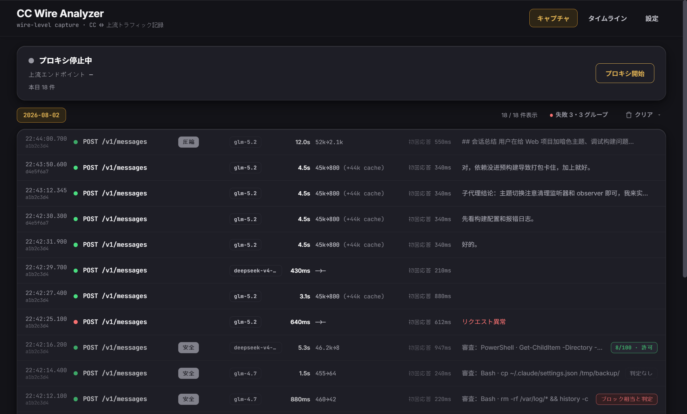
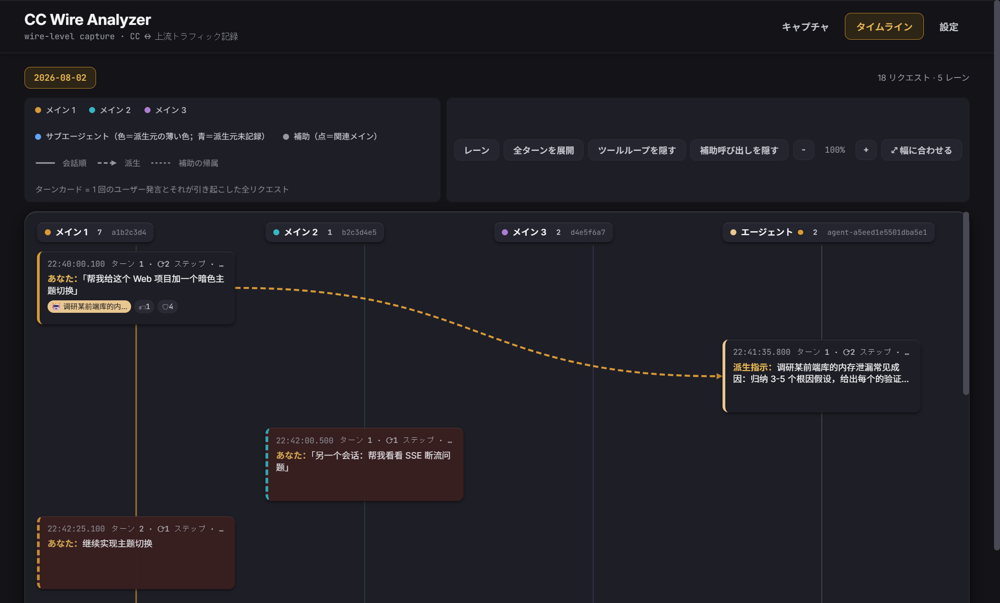
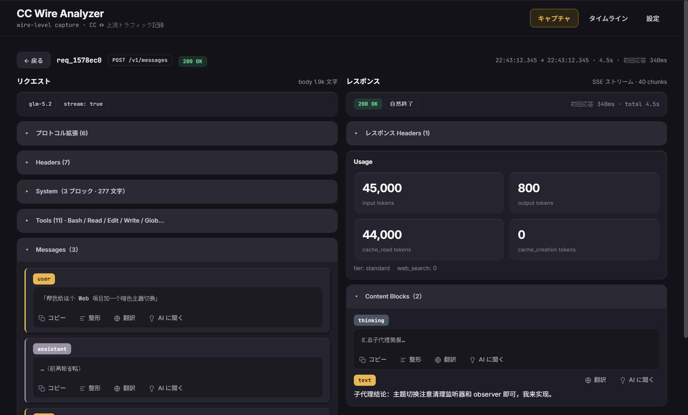
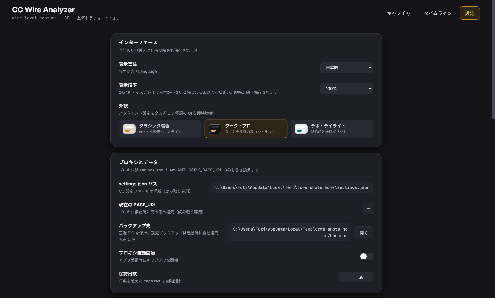
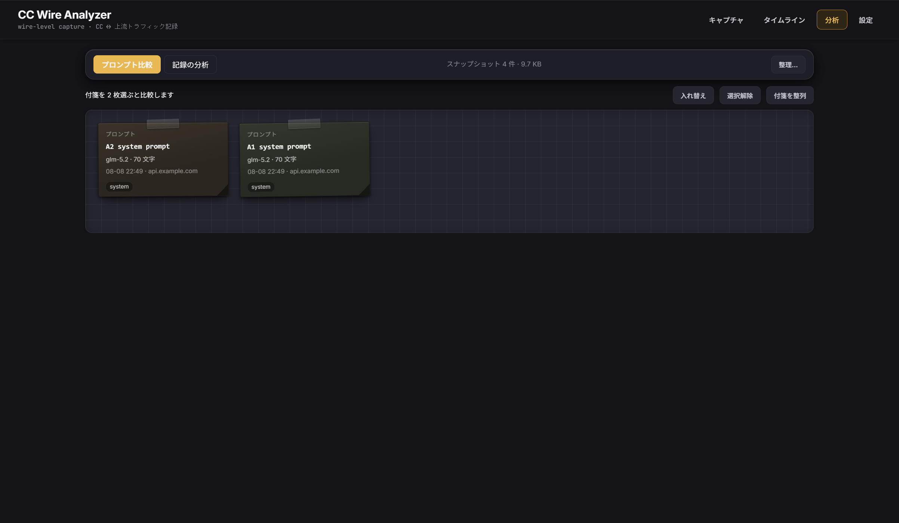

# CC Wire Analyzer

Claude Code と上流エンドポイント間の全 HTTP トラフィックを透過的に**完全録画**するローカル MITM プロキシのデスクトップアプリ——`~/.claude/projects/*.jsonl`（CC の後処理済みビュー）や OTLP テレメトリでは見えないリンクレベルの次元を補います。

[English](README.md) · [中文](README.zh.md)

[リリース一覧](../../releases) · [変更履歴](CHANGELOG.md)

## こんなときに使う

Claude Code が見せるのは CC 自身の視点でのセッションです。wire レイヤーが見せるのは、実際に何が送られ、実際に何が返ってきたか——この二つは同じものではありません。CC とモデルの間の本当のやり取りを理解したいとき、wire が必要です：

- **CC がモデルに何を送っているのか確かめたい。** 送信されたままの system prompt 全文（ウォーターマークフィールドも含む）、どのリクエストでどのツールが宣言されたか、サブエージェントがいつどんなプロンプトで派生したか、目に触れることのないバックグラウンドのセキュリティ分類器呼び出し、SSE チャンクのタイミング、上流が報告したままのトークン数——後から要約されたものではなく。
- **各ステージのプロンプトがどう書かれているか読みたい。** CC は一つの会話ではなく、メイン対話に加え、タイトル生成、セキュリティ審査、コンテキスト圧縮があり、各ステージに固有の system prompt とツール群があります。wire レイヤーはそれを並べて示します：メインの system prompt が実際に何を言っているか、ツール記述がどう書かれているか、user メッセージがどう包まれて注入されるか、サブエージェントのプロンプトが派生元とどう違うか。プロンプトエンジニアリングがそこにあります。
- **agent に解析させる。** すべてローカルのプレーンな JSONL に書かれ、GUI が使うのと同じエンドポイントが HTTP で開かれています——後から自分で（あるいは別の agent が）セッションを遡って検索・クロス分析でき、その瞬間を再現する必要はありません。

## スクリーンショット

| キャプチャ一覧 | タイムライン DAG |
|---|---|
|  |  |

| リクエスト詳細 | 設定 |
|---|---|
|  |  |

| 分析 —— スナップショット＆差分 |
|---|
|  |

スクリーンショットは v0.4.7 からの既定の外観「ダーク・プロ」です。設定画面には
「クラシック暖色」（v0.4.7 以前のインターフェース）と「ラボ・デイライト」もあります。
外観はインターフェースにローカルな設定で、プロキシの構成には一切触れません。

## 実例：録画を agent に渡す

セッションタイトルが生成されなくなりました。Claude Code はエラーを一切表示しません——タイトルが出てこないだけ。目で探し回る代わりに、agent にツールを指し示します：

> `http://127.0.0.1:<port>/api/ai-guide` を読み、セッションタイトルが生成されない理由を突き止めて。

agent が自分でエンドポイントを辿ります——`GET /api/diagnose/errors` で当日の失敗を上流メッセージ別に見、`GET /api/captures/<id>` でサンプルを一件取得——そして上流の実際の答えを持って戻ります：

```
output_config.effort 'max' is not supported when thinking is disabled on this model.
Use effort 'high' or below, or enable thinking.
```

原因は設定の矛盾でした：`settings.json` のトップレベルは `effortLevel: low`、一方環境変数が `CLAUDE_CODE_EFFORT_LEVEL: max`——環境変数が勝ちます。CC 自身のビューには何の手がかりもなく、失敗していたリクエストは wire レイヤーでしか見えません。agent の呼び出し一回で答えが出る——タイムラインを目で追ったり、その瞬間を再現したりする必要はありません。

この発見はチェックとしても固定できます（内蔵の設定ヘルスチェックがまさにそれをします）。より一般的に言えば：録画は機械可読で、中の失敗は上流によって既に一度診断済みです——agent がその診断を直接取り出せます。

## トラフィックを預けて安全か

MITM プロキシを名乗るものに対して、当然聞くべき問いです。正直に答えると、4 点あります：

- **録画がマシンの外に出ることはありません。** 録画は `~/.cc-wire-analyzer/` にプレーンな JSONL として書き出され、トラフィックは CC が元々使っていた上流にそのまま転送されます。テレメトリもアカウントもアップロードもありません。本アプリ自身の外部通信は 2 つだけで、どちらもクリックしたときのみ発生します：詳細ビューの任意機能である翻訳 / AI 解説（選択した内容を**あなたが**設定したエンドポイントへ送信）と、情報パネルの「更新を確認」（api.github.com に最新リリースの tag を問い合わせるだけで、あなたに関する情報は送りません）。
- **触るのは設定 1 フィールド、終了時に復元。** プロキシが編集するのは `~/.claude/settings.json` の `ANTHROPIC_BASE_URL` のみで、それ以外——トークン、モデルマッピング、OTLP 設定——には手を触れません。編集前にバックアップを取り、復元はウィンドウの closing イベント・`atexit`・シグナル・起動時の孤児チェックに紐づけられ、最後の手段として `restore` コマンドもあります。復元されるのは「自分がやったと今も証明できる変更」だけです——その間にあなたや cc-switch が `BASE_URL` を変えていた場合、ファイルには触れません。
- **認証情報はマスクされますが、メッセージ内容はされません。** `Authorization` などのヘッダーはマスクして保存されます。一方でリクエスト／レスポンスの body は**そのまま**保存されます——それこそが本ツールの目的ですが、つまり録画にはあなたのプロンプト、セッションに引用されたファイルの中身、システムプロンプト全文が含まれます。capture ファイルは機微データとして扱ってください：中身を確認せずにチャットに貼ったり、バグ報告に添付したりしないでください。
- **既存の構成と共存します。** 公式エンドポイント直結、サードパーティのゲートウェイ、cc-switch——いずれも対応します。ただしプロキシの稼働中に cc-switch でエンドポイントを切り替えないでください：`BASE_URL` が書き換えられ、CC がプロキシを迂回します。本アプリはこれを監視していて、起きた場合には通知します。録画中の cc-switch「現在の設定をプロファイルに保存」も避けてください——書き換えられた settings を読み取ってローカルプロキシアドレスをそのプロファイルに保存してしまい、後で切り替えると CC が応答のないポートを指します（これは防げません、settings.json は読まれるだけで変更されないため）。また、録画開始時に `BASE_URL` が既にローカルアドレスだった場合（前回の録画残留、汚染されたプロファイル）、本アプリは確認を促します。

## 主な機能

- **非侵入** —— `~/.claude/settings.json` の `ANTHROPIC_BASE_URL` だけを編集。トークン、モデルマッピング、OTLP 設定は全保持。アプリ終了時にバイト級で復元します。
- **公式直通・サードパーティ両対応** —— `ANTHROPIC_BASE_URL` なし（Anthropic へ直通）でも動作、公式エンドポイントのキャプチャにフォールバック。設定されていればそれに従います（例：[cc-switch](https://github.com/farion1231/cc-switch) で設定したゲートウェイ）。
- **透過ストリーミング** —— SSE を録画しながら転送。CC にとって直通と全く同じ感覚です。
- **クラッシュ保護** —— 原子書き込み + 起動ごとのバックアップ + atexit/signal/excepthook の三重復元 + 孤児バックアップ復元。
- **タイムライン DAG** —— スイムレーンビュー。各メインセッションはレーンヘッダー、軸、ノード枠線、エッジに独自の色を持ちます。サブエージェント/補助ノードは関連セッションの色の点を持ち、何が何を派生したかが一目で分かります。
- **詳細ツール** —— 翻訳、「これが何を意味するか AI に聞く」（プロンプト注入ガード付き）、整形/プリティプリント。UI は**中国語/英語/日本語**切り替え対応（即時・永続化）。
- **スナップショット＆差分（Analyse タブ）** —— プロンプト1件または録画全体をスナップショットとしてバックアップし、差分比較。肉眼では見えない差異を可視化（中国向けの CC 文字ウォーターマーク——日付の `-`/`/` 入れ替え、アポストロフィの同形字——を見える sentinel として表示）。思考チェーンを3層で抽出（予算厳守）、内蔵モデルで複数ターンの分析対話。スナップショット単位はリクエスト1件、セッション単位ではない。
- **録画クリア** —— その日のキャプチャを消去（直接削除 / zip 書庫化してから削除）、インライン二段階確認付き。
- **ブラインドスポットレーダー** —— `GET /api/unknowns` が、ツールがまだ認識できないプロトコル値（新規ブロック型・フィールド、未解析リクエストフィールド、非標準列挙、ベータ機能のロングテール）を能動的にフラグ付け。各項目に内容スニペット + それが伴うベータ機能を付記。CC が新ベータを出すときの早期警告であり、他の agent フレームワークへ移植するときは「新プロトコルを推測する」を「一度スキャンして未知を個別確認し、そのフレームの既知セットを構築する」に変える発見ツール。
- **クロスプラットフォーム** —— Windows `.exe` と macOS `.app`、GitHub Actions でビルド。**フォント同梱**（Inter + JetBrains Mono + Noto Sans SC）で、どのマシンでも同じ見た目。

## クイックスタート

### 方法 A —— リリースビルドをダウンロード

[Releases](../../releases) から最新の `cc-wire-analyzer-windows.exe` または `cc-wire-analyzer-macos.zip` を取得。Python は不要。

- **Windows**：`.exe` をダブルクリック。WebView2 不足を警告されたら [Microsoft Edge WebView2 Runtime](https://developer.microsoft.com/microsoft-edge/webview2/) をインストール。
- **macOS**：解凍し、`cc-wire-analyzer.app` を `/Applications` にドラッグ。アプリは**未署名・未公証**（無料 OSS プロジェクトの標準——署名は年 $99 かかります）のため、**初回起動は Gatekeeper にブロックされます**。一度だけ許可してください：
  - `cc-wire-analyzer.app` を右クリック →「開く」→ダイアログで「開く」を確認、**または**
  - 新しい macOS で上記が出ない場合：**システム設定 → プライバシーとセキュリティ → 下部の「このまま開く」**をクリック。
  - 初回許可後は通常通り開き、以降プロンプトは出ません。（Apple のセキュリティ措置であり、アプリの不具合ではありません。）

### 方法 B —— ソースから実行

```bash
git clone <this-repo> && cd cc-wire-analyzer
uv sync                 # Windows
uv sync --extra mac     # macOS（pyobjc をインストール）
uv run python src/desktop.py
```

アプリ内で**プロキシ開始**をクリックし、新しい Claude Code セッションを開いて普通に使う——トラフィックがキャプチャ一覧に現れます。

## 仕組み（30 秒版）

1. **プロキシ開始**をクリック。
2. アプリが `~/.claude/settings.json` をバックアップし、`ANTHROPIC_BASE_URL` を `http://127.0.0.1:<ポート>` に設定（この一フィールドだけ、他は触らない）。
3. Claude Code の全リクエストがローカルプロキシに送られ、プロキシは録画（JSONL、ヘッダーはマスク）しながら本当の上流へ転送。
4. **プロキシ停止**（またはアプリ終了）→ `ANTHROPIC_BASE_URL` がバイト級で復元。

プロキシ実行中は **cc-switch でエンドポイントを切り替えないで**——`BASE_URL` を書き換えるため CC がプロキシをバイパスします。

## Claude Code が API エラーを出すとき

録画は `ANTHROPIC_BASE_URL` を一時的にローカルプロキシに向けることで機能し、アプリ終了時に復元します（多重の安全網 + 孤立マーカーによる自己修復）。録画後に CC が API エラーを出す——接続拒否、401、タイムアウト——場合は、`~/.claude/settings.json` の `BASE_URL` が古いか間違っているのがほぼ原因です。エンドポイント種別に応じて対処してください：

- **サードパーティ API / ゲートウェイ**：`~/.claude/settings.json` を開き、`ANTHROPIC_BASE_URL` をゲートウェイのアドレスに戻します（または cc-switch で切り替え）。
- **公式 Anthropic サブスクリプション**：`ANTHROPIC_BASE_URL` フィールドを**完全に削除**します——公式エンドポイントに base URL は不要です——そして **Claude Code を完全に終了して再起動**してください。CC は起動時にしか `BASE_URL` を読み込まないため、実行中にファイルを編集しても反映されません。

## データ位置

| パス | 内容 |
|------|---------|
| `~/.cc-wire-analyzer/captures/<YYYY-MM-DD>.jsonl` | リクエスト/レスポンス録画（追記専用） |
| `~/.cc-wire-analyzer/archives/<date>.<HHMMSS>.jsonl.zip` | 書庫化録画（「zip 書庫化してから削除」時） |
| `~/.cc-wire-analyzer/snapshots/snap_*.json`（+ `.chat.jsonl`、`index.jsonl`） | Analyse タブで保存したスナップショット——自動削除されない（`retention_days` 対象外）、タブに合計容量が表示される |
| `~/.cc-wire-analyzer/backups/settings.json.<ts>` | settings.json バックアップ（直近 5 件保持） |
| `~/.cc-wire-analyzer/config.json` | アプリ設定（ui_lang / translate / explain…） |
| `~/.cc-wire-analyzer/run.log` | 実行ログ |

## AI エージェント向け：HTTP で操作する

このツールは人が見るためだけのものではありません —— **エージェント自身が起動し、調べられます**。
バイナリ 1 つ、3 つの呼び出し方：

- `cc-wire-analyzer.exe`（ダブルクリック）→ GUI を開く
- `cc-wire-analyzer.exe serve` → **バックグラウンド HTTP サービス + プロキシ**を起動（ウィンドウなし、エージェント用）
- `cc-wire-analyzer.exe --help` → 使い方の全文を出力して終了（ウィンドウなし）

**説明書はバイナリに同梱されています。** エージェントから使うのにこのリポジトリは不要です：
`--help` が説明書を出力し、サービス起動後は `GET /api/ai-guide` が同じ本文に加えて、そのマシンの
実行時情報（実際のポート、データディレクトリの絶対パス、記録中かどうか）を返します。
つまり、自分のエージェントへの引き継ぎは一文で済みます：

> このマシンで CC Wire Analyzer が動いています。`http://127.0.0.1:<port>/api/ai-guide` を読んで、
> そこから操作してください。（ポートは `~/.cc-wire-analyzer/port.txt` にあります。）

`127.0.0.1` の HTTP で操作します（GUI と同じエンドポイント）：

```bash
cc-wire-analyzer.exe serve &                     # サービス + プロキシ起動（settings.json を patch）
port=$(cat ~/.cc-wire-analyzer/port.txt)
curl 127.0.0.1:$port/api/proxy/status            # 記録中か？
# …記録したいセッションを実行…
curl -X POST 127.0.0.1:$port/api/proxy/stop
curl "127.0.0.1:$port/api/captures?date=2026-07-13"
```

1 件の記録が 5 MB を超えることがあるため、まず概要を取得し id で個別取得します。
API 全一覧・レコード schema・安全上の注意は **[docs/reference/AI_USAGE.md](docs/reference/AI_USAGE.md)**。

macOS も同じバイナリ 1 つ —— `cc-wire-analyzer.app/Contents/MacOS/cc-wire-analyzer serve`。

## オプション：翻訳 / AI に聞く

詳細ページは、OpenAI 互換の `/chat/completions` エンドポイント経由でテキスト翻訳や「この内容が何をするものか」解説ができます。**設定 → LLM モデル**で API キー / base URL / model を設定。解説機能には組み込みの注入ガードがあります（信頼できないキャプチャ内容はデリミタで包まれ、リテラルの閉じタグはエスケープされ、隔離フレームはハードコードされておりカスタムプロンプトの影響を受けません）。

## ソースからビルド

ビルド手順は [CONTRIBUTING.md](CONTRIBUTING.md#building) に一元化（Windows/macOS のコマンドが分岐しないよう単一ソース）。リリースは [`.github/workflows/release.yml`](.github/workflows/release.yml) が各 `v*` タグで自動ビルドします。

## 他の観測性ツールとの関係

本ツールは**リンクレベル**（生 HTTP）をカバー。jsonl ベースの会話アナライザ（CC 自身のビュー）や OTLP テレメトリ（メトリクスビュー）と相性が良い——三者は補完的。

## ライセンス

- コード：**MIT**。
- ドキュメントと文章（README / docs / アプリ内テキスト）：**CC BY 4.0** —— 再利用時は出典を明記。
- 同梱フォント（Inter / JetBrains Mono / Noto Sans SC）：**SIL OFL 1.1**。
- 同梱 JS（marked.js：MIT、DOMPurify：Apache-2.0/MPL-2.0）。

全文は [LICENSE](LICENSE)（英語）を参照。技術ドキュメントは [docs/reference/API契约.md](docs/reference/API契约.md)、開発設定は [CONTRIBUTING.md](CONTRIBUTING.md) を参照。
