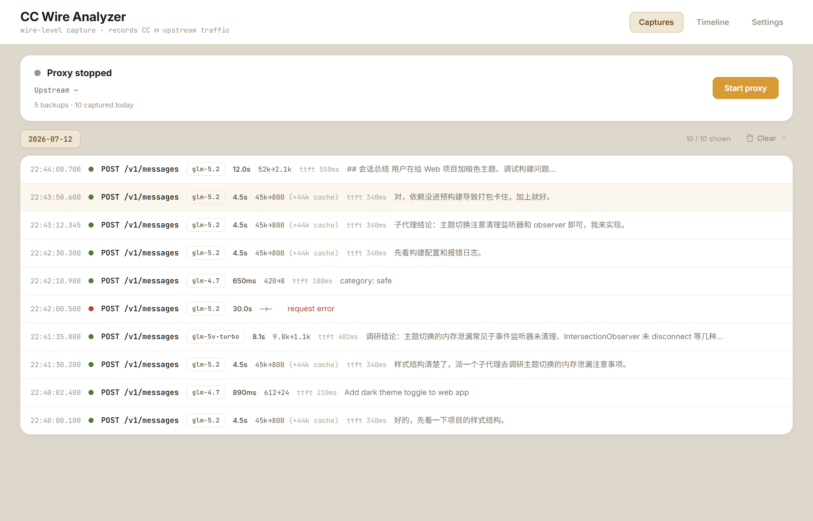
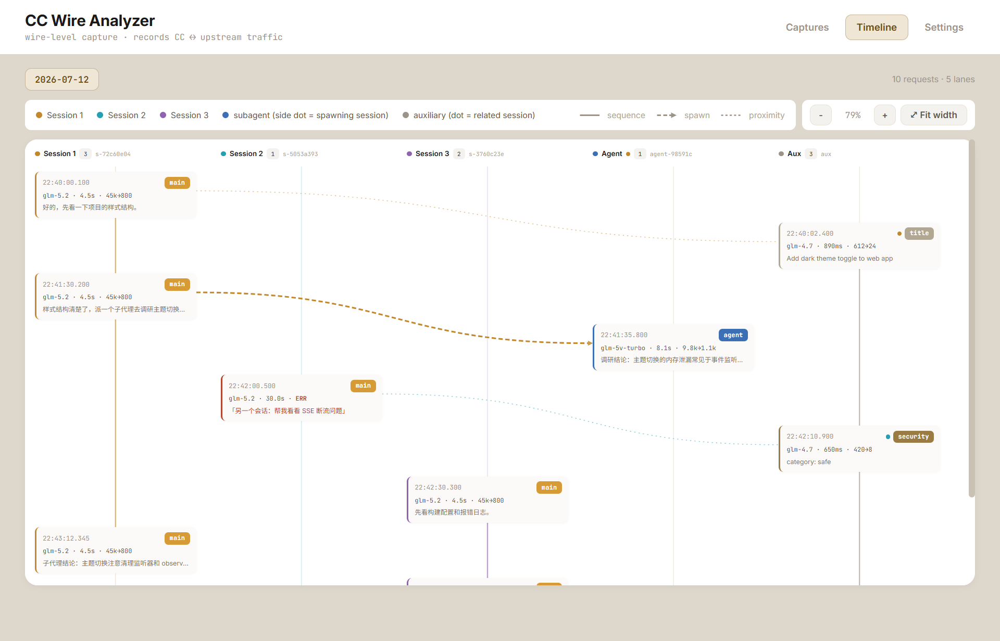
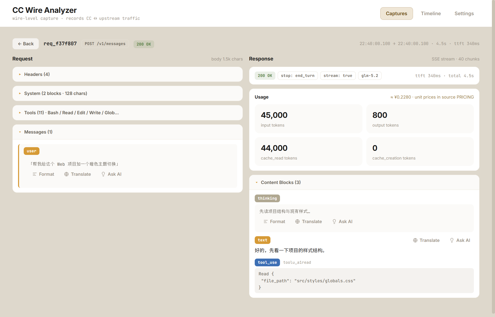
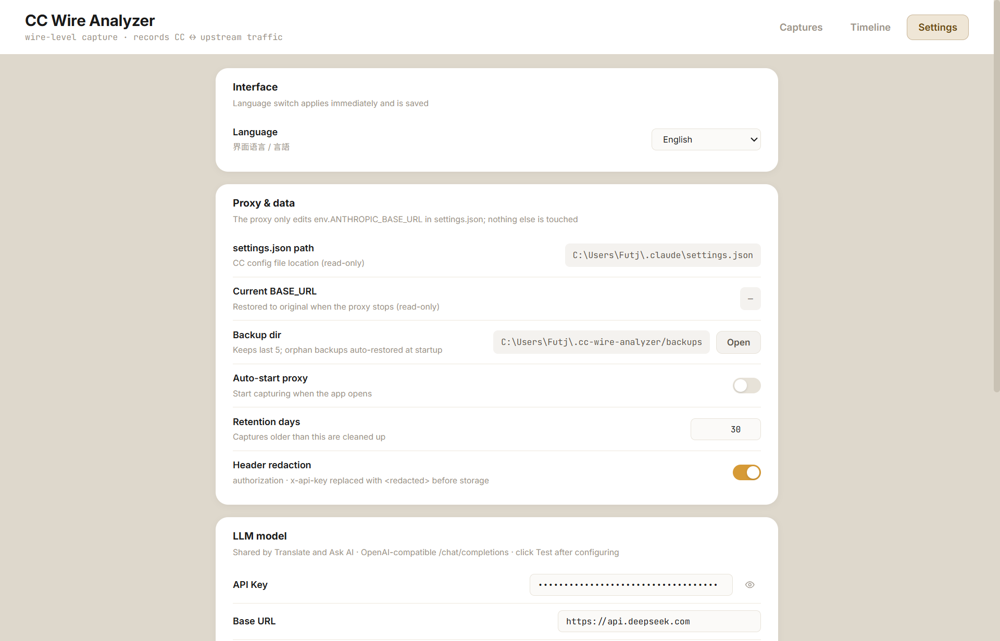

# CC Wire Analyzer

A local MITM proxy desktop app that transparently records and analyzes all HTTP traffic between **Claude Code** and its upstream endpoint — filling the wire-level gap that `~/.claude/projects/*.jsonl` (CC's post-processed view) and OTLP telemetry can't show.

[中文](README.zh.md) · [日本語](README.ja.md)

## What it shows that you can't otherwise see

When Claude Code talks to an upstream (Anthropic official, or a third-party gateway), the outgoing requests hide link-level truth that jsonl/OTLP can't capture: the raw watermark fields in the system prompt, SSE chunk timing, the exact upstream response, security-classifier calls, precise token cost. This tool spins up a local proxy, temporarily points CC's `ANTHROPIC_BASE_URL` at it, and **records + forwards** everything — so those truths become observable.

## Screenshots

| Captures | Timeline DAG |
|---|---|
|  |  |

| Request detail | Settings |
|---|---|
|  |  |

## Features

- **Zero intrusion** — only edits `ANTHROPIC_BASE_URL` in `~/.claude/settings.json`; token, model mapping, OTLP config all preserved. Closing the app byte-restores the file.
- **Works with official-direct and third-party endpoints** — no `ANTHROPIC_BASE_URL` (direct to Anthropic) works too, falling back to capture the official endpoint; if present, follows it (e.g. a gateway configured via [cc-switch](https://github.com/farion1231/cc-switch)).
- **Transparent streaming** — SSE is forwarded while recorded; CC feels identical to a direct connection.
- **Crash protection** — atomic writes + per-start backup + atexit/signal/excepthook triple restore + orphan-backup recovery.
- **Timeline DAG** — swimlane view; each main session gets its own color across the lane header, axis, node border, and edges; subagent/auxiliary nodes carry a dot in their related session's color so you can see what spawned what at a glance.
- **Detail tools** — translate, "ask AI what this does" (with prompt-injection guard), format/pretty-print; UI supports **Chinese / English / Japanese** switch (instant, persisted).
- **Clear recordings** — clear a day's captures (direct delete / archive-to-zip then delete), with inline two-step confirm.
- **Cross-platform** — Windows `.exe` and macOS `.app`, built via GitHub Actions. **Fonts are bundled** (Inter + JetBrains Mono + Noto Sans SC) so the UI looks identical on every machine.

## Quick start

### Option A — download a release build

Grab the latest `cc-wire-analyzer-windows.exe` or `CCWireAnalyzer-mac.zip` from [Releases](../../releases). No Python needed.

- **Windows**: double-click the `.exe`. If it warns about WebView2 missing, install [Microsoft Edge WebView2 Runtime](https://developer.microsoft.com/microsoft-edge/webview2/).
- **macOS**: unzip, drag `CCWireAnalyzer.app` to `/Applications`. The app is **unsigned and un-notarized** (normal for a free open-source project — code-signing costs $99/year), so **Gatekeeper blocks the first launch**. Allow it once:
  - Right-click `CCWireAnalyzer.app` → **Open** → confirm **Open** in the dialog; **or**
  - On newer macOS where that's unavailable: **System Settings → Privacy & Security → scroll to the bottom → click "Open Anyway"**.
  - After the first launch, it opens normally with no further prompts. (This is an Apple security measure, not a problem with the app.)

### Option B — run from source

```bash
git clone <this-repo> && cd cc-wire-analyzer
uv sync                 # Windows
uv sync --extra mac     # macOS (installs pyobjc)
uv run python src/desktop.py
```

Then click **Start proxy** in the app, open a new Claude Code session, use it normally — traffic appears in the captures list.

## How it works (the 30-second version)

1. You click **Start proxy**.
2. The app backs up `~/.claude/settings.json`, then sets `ANTHROPIC_BASE_URL` to `http://127.0.0.1:<port>` (one field, nothing else touched).
3. Claude Code now sends all requests to the local proxy, which records (JSONL, headers redacted) and forwards them to the real upstream.
4. You click **Stop proxy** (or close the app) → `ANTHROPIC_BASE_URL` is restored byte-for-byte.

While the proxy runs, **don't switch endpoints with cc-switch** — it rewrites `BASE_URL` and CC would bypass the proxy.

## Data location

| Path | Content |
|------|---------|
| `~/.cc-wire-analyzer/captures/<YYYY-MM-DD>.jsonl` | Request/response recordings (append-only) |
| `~/.cc-wire-analyzer/archives/<date>.<HHMMSS>.jsonl.zip` | Archived recordings (when you "archive then clear") |
| `~/.cc-wire-analyzer/backups/settings.json.<ts>` | settings.json backups (keeps last 5) |
| `~/.cc-wire-analyzer/config.json` | App config (ui_lang / translate / explain …) |
| `~/.cc-wire-analyzer/run.log` | Run log |

## For AI agents: drive it from the command line

This tool is not only for humans to look at — **an agent can drive it too**. `cc-wire-analyzer-cli`
starts the proxy, locates the recordings, and answers questions about them, all in JSON:

```bash
cc-wire-analyzer-cli proxy start                       # patch settings.json, run headless
cc-wire-analyzer-cli stats  --date 2026-07-12          # kinds, models, tokens, latency
cc-wire-analyzer-cli list   --date 2026-07-12 --kind main --limit 20
cc-wire-analyzer-cli get    req_a5f758e --part system --max-chars 4000
cc-wire-analyzer-cli restore                           # rescue a settings.json left pointing at a dead port
```

Output is truncated by default and says so — one capture can exceed 5 MB, so an agent must never
read the JSONL directly. Full reference, record schema, and safety notes: **[docs/AI_USAGE.md](docs/AI_USAGE.md)**.

Works on macOS too (`cc-wire-analyzer-cli-mac`, or the binary inside `CCWireAnalyzer.app/Contents/MacOS/`).
The CLI ships as a **separate console binary** because the GUI build is windowed and has no stdout.

## Optional: translate / ask-AI

The detail page can translate text or explain "what does this content do" via any OpenAI-compatible `/chat/completions` endpoint. Configure API key / base URL / model in **Settings → LLM model**. The explain feature has a built-in injection guard (the untrusted captured content is wrapped in delimiters; literal closing tags are escaped; the isolation frame is hardcoded and unaffected by your custom prompt).

## Build from source

- **Windows**: `uv run pyinstaller build.spec`
- **macOS**: `uv sync --extra mac && uv run pyinstaller build-mac.spec`

Releases are built automatically by [`.github/workflows/release.yml`](.github/workflows/release.yml) on every `v*` tag.

## Relationship to other observability tools

This tool covers the **wire level** (raw HTTP). It pairs well with jsonl-based conversation analyzers (CC's own view) and OTLP telemetry (metrics view) — the three are complementary.

## License

- Code: **MIT**.
- Documentation and prose (README / docs / in-app text): **CC BY 4.0** — credit the source if you reuse it.
- Bundled fonts (Inter / JetBrains Mono / Noto Sans SC): **SIL OFL 1.1**.
- Bundled JS (marked.js: MIT; DOMPurify: Apache-2.0/MPL-2.0).

Full text in [LICENSE](LICENSE). See [CONTRIBUTING.md](CONTRIBUTING.md) for development setup.
