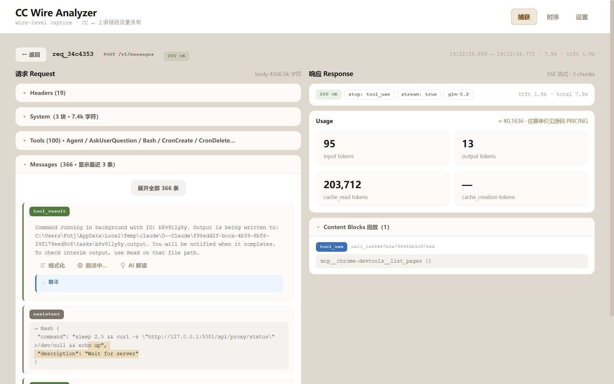
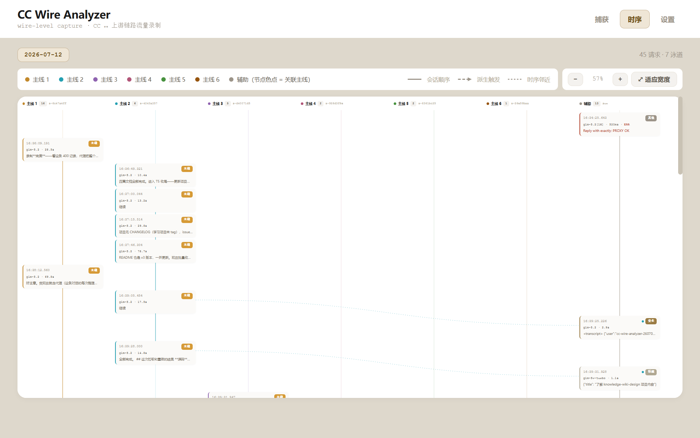
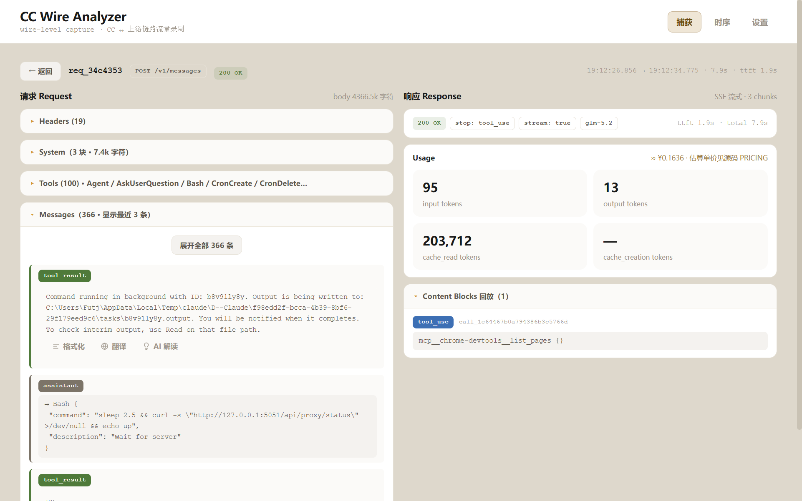
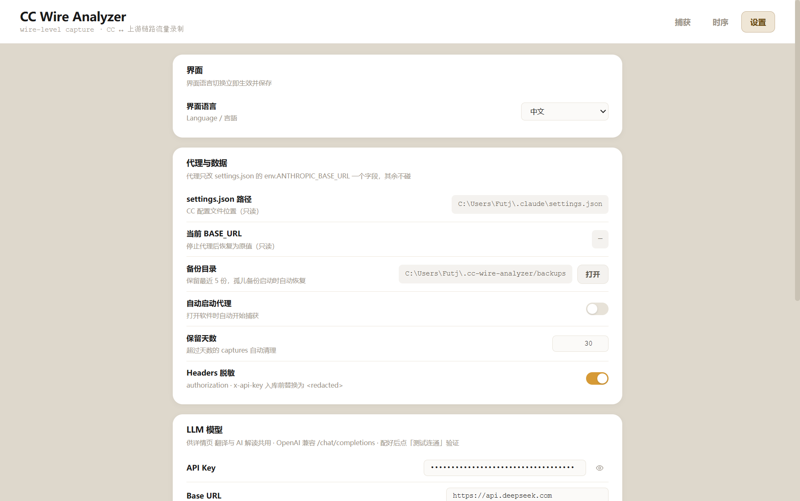

# CC Wire Analyzer

A local MITM proxy desktop app that transparently records and analyzes all HTTP traffic between **Claude Code** and its upstream endpoint — filling the wire-level gap that `~/.claude/projects/*.jsonl` (CC's post-processed view) and OTLP telemetry can't show.

[日本語](#日本語) · [中文](#中文)

## What it shows that you can't otherwise see

When Claude Code talks to an upstream (Anthropic official, or a third-party gateway), the outgoing requests hide link-level truth that jsonl/OTLP can't capture: the raw watermark fields in the system prompt, SSE chunk timing, the exact upstream response, security-classifier calls, precise token cost. This tool spins up a local proxy, temporarily points CC's `ANTHROPIC_BASE_URL` at it, and **records + forwards** everything — so those truths become observable.

## Screenshots

| Captures | Timeline DAG |
|---|---|
|  |  |

| Request detail | Settings |
|---|---|
|  |  |

## Features

- **Zero intrusion** — only edits `ANTHROPIC_BASE_URL` in `~/.claude/settings.json`; token, model mapping, OTLP config all preserved. Closing the app byte-restores the file.
- **Works with official-direct and third-party endpoints** — no `ANTHROPIC_BASE_URL` (direct to Anthropic) works too, falling back to capture the official endpoint; if present, follows it (e.g. a gateway configured via [cc-switch](https://github.com/farion1231/cc-switch)).
- **Transparent streaming** — SSE is forwarded while recorded; CC feels identical to a direct connection.
- **Crash protection** — atomic writes + per-start backup + atexit/signal/excepthook triple restore + orphan-backup recovery.
- **Timeline DAG** — swimlane view; each main session gets its own color across the lane header, axis, node border, and edges; subagent/auxiliary nodes carry a dot in their related session's color so you can see what spawned what at a glance.
- **Detail tools** — translate, "ask AI what this does" (with prompt-injection guard), format/pretty-print; UI supports **Chinese / English / Japanese** switch (instant, persisted).
- **Clear recordings** — clear a day's captures (direct delete / archive-to-zip then delete), with inline two-step confirm.
- **Cross-platform** — Windows `.exe` and macOS `.app`, built via GitHub Actions. **Fonts are bundled** (Inter + JetBrains Mono + Noto Sans SC) so the UI looks identical on every machine.

## Quick start

### Option A — download a release build

Grab the latest `cc-wire-analyzer-windows.exe` or `CCWireAnalyzer-mac.zip` from [Releases](../../releases). No Python needed.

- **Windows**: double-click the `.exe`. If it warns about WebView2 missing, install [Microsoft Edge WebView2 Runtime](https://developer.microsoft.com/microsoft-edge/webview2/).
- **macOS**: unzip, drag `CCWireAnalyzer.app` to `/Applications`. First launch, right-click → Open (the app is unsigned, so Gatekeeper will prompt).

### Option B — run from source

```bash
git clone <this-repo> && cd cc-wire-analyzer
uv sync                 # Windows
uv sync --extra mac     # macOS (installs pyobjc)
uv run python src/desktop.py
```

Then click **Start proxy** in the app, open a new Claude Code session, use it normally — traffic appears in the captures list.

## How it works (the 30-second version)

1. You click **Start proxy**.
2. The app backs up `~/.claude/settings.json`, then sets `ANTHROPIC_BASE_URL` to `http://127.0.0.1:<port>` (one field, nothing else touched).
3. Claude Code now sends all requests to the local proxy, which records (JSONL, headers redacted) and forwards them to the real upstream.
4. You click **Stop proxy** (or close the app) → `ANTHROPIC_BASE_URL` is restored byte-for-byte.

While the proxy runs, **don't switch endpoints with cc-switch** — it rewrites `BASE_URL` and CC would bypass the proxy.

## Data location

| Path | Content |
|------|---------|
| `~/.cc-wire-analyzer/captures/<YYYY-MM-DD>.jsonl` | Request/response recordings (append-only) |
| `~/.cc-wire-analyzer/archives/<date>.<HHMMSS>.jsonl.zip` | Archived recordings (when you "archive then clear") |
| `~/.cc-wire-analyzer/backups/settings.json.<ts>` | settings.json backups (keeps last 5) |
| `~/.cc-wire-analyzer/config.json` | App config (ui_lang / translate / explain …) |
| `~/.cc-wire-analyzer/run.log` | Run log |

## Optional: translate / ask-AI

The detail page can translate text or explain "what does this content do" via any OpenAI-compatible `/chat/completions` endpoint. Configure API key / base URL / model in **Settings → LLM model**. The explain feature has a built-in injection guard (the untrusted captured content is wrapped in delimiters; literal closing tags are escaped; the isolation frame is hardcoded and unaffected by your custom prompt).

## Build from source

- **Windows**: `uv run pyinstaller build.spec`
- **macOS**: `uv sync --extra mac && uv run pyinstaller build-mac.spec`

Releases are built automatically by [`.github/workflows/release.yml`](.github/workflows/release.yml) on every `v*` tag.

## Relationship to other observability tools

This tool covers the **wire level** (raw HTTP). It pairs well with jsonl-based conversation analyzers (CC's own view) and OTLP telemetry (metrics view) — the three are complementary.

## License

- Code: **MIT**.
- Documentation and prose (README / docs / in-app text): **CC BY 4.0** — credit the source if you reuse it.
- Bundled fonts (Inter / JetBrains Mono / Noto Sans SC): **SIL OFL 1.1**.
- Bundled JS (marked.js: MIT; DOMPurify: Apache-2.0/MPL-2.0).

Full text in [LICENSE](LICENSE). See [CONTRIBUTING.md](CONTRIBUTING.md) for development setup.

---

## 中文

本地 MITM 代理桌面应用，透明转发并完整录制 Claude Code ↔ 上游端点的全部 HTTP 流量，填补 jsonl/OTLP 看不到的链路级维度。

**特性**：零侵入（只改 BASE_URL 一字段，关闭字节级复原）/ 支持官方直连与第三方端点 / 流式透明 / 崩溃三重保护 / 泳道时序 DAG（主线多色 + 关联着色）/ 详情工具（翻译、AI 解读带防注入、格式化）/ 中英日三语 / 清理录制（删除/压缩存档）/ Windows + macOS 双平台、字体打包保证跨平台视觉一致。

**快速开始**：从 [Releases](../../releases) 下载 `cc-wire-analyzer-windows.exe` 或 `CCWireAnalyzer-mac.zip`；或源码 `uv sync`（macOS 加 `--extra mac`）后 `uv run python src/desktop.py`。

**原理**：点"启动代理"→ 备份 settings.json → 把 BASE_URL 改指向本地代理（只这一字段）→ CC 流量经代理录制转发 → 停止时字节级复原。代理运行期间勿用 cc-switch 切换端点。

API 契约等技术文档见 [docs/API契约.md](docs/API契约.md)（中文）。许可证：代码 MIT / 文档 CC BY 4.0，字体 OFL。

---

## 日本語

Claude Code と上流エンドポイント間の全 HTTP トラフィックを透過的に録画・分析するローカル MITM プロキシのデスクトップアプリ。jsonl/OTLP では見えないリンクレベルの情報を補います。

主な機能：ゼロ侵入（BASE_URL のみ編集、終了時にバイト級復元）/ 公式直通とサードパーティ両対応 / ストリーミング透過 / クラッシュ三重保護 / スイムレーン時系列 DAG / 詳細ツール（翻訳・AI 解説・整形）/ 中国語・英語・日本語切り替え / 録画クリア（削除・圧縮保存）/ Windows + macOS デュアルプラットフォーム、フォント同梱でクロスプラットフォームの視覚的一致。

クイックスタート：[Releases](../../releases) からビルドをダウンロード、またはソースから `uv sync`（macOS は `--extra mac`）→ `uv run python src/desktop.py`。

ライセンス：コード MIT / ドキュメント CC BY 4.0、フォント OFL。
