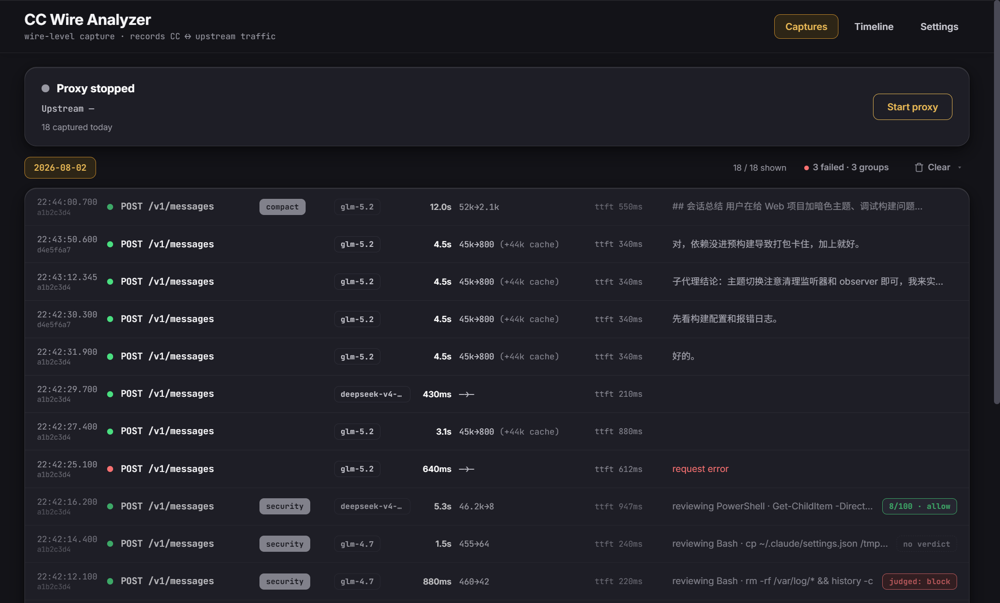
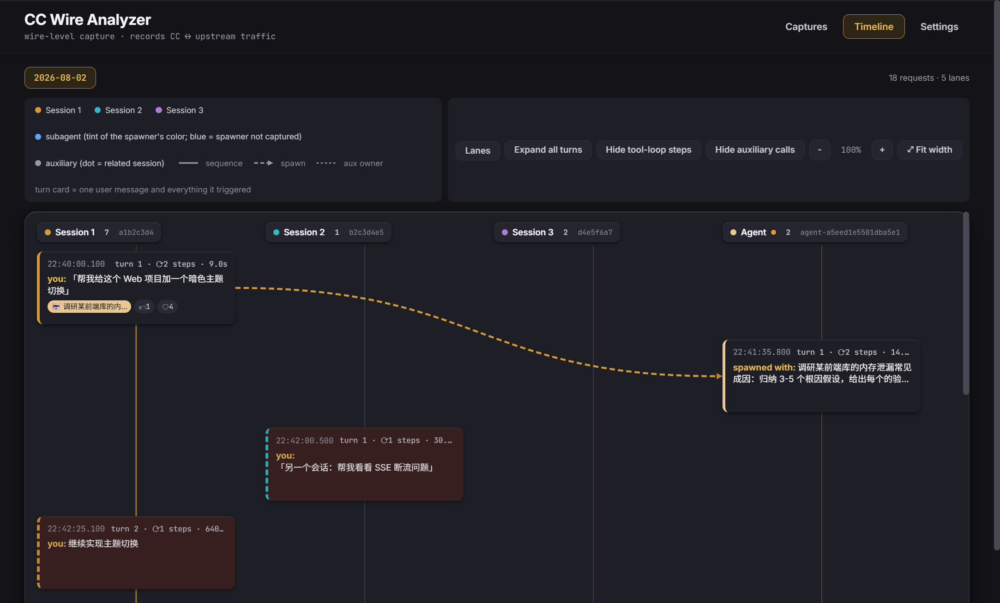
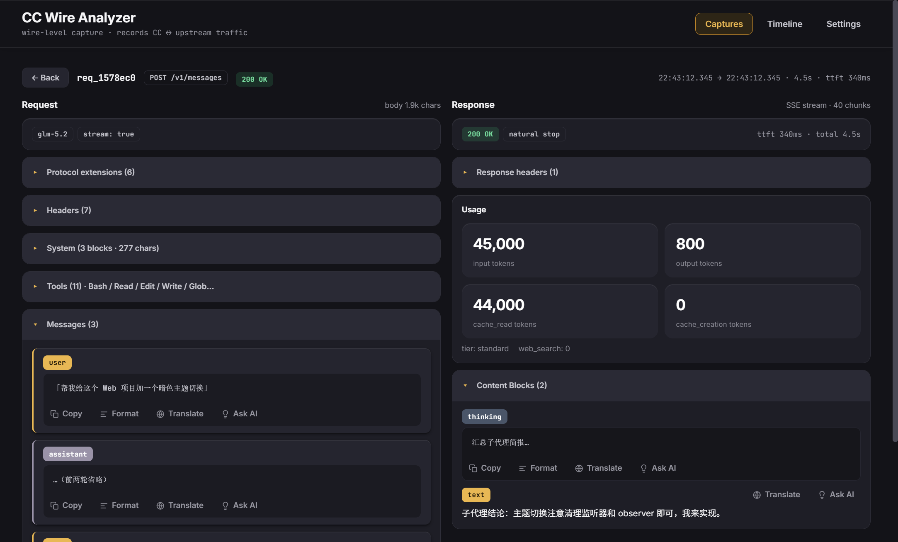
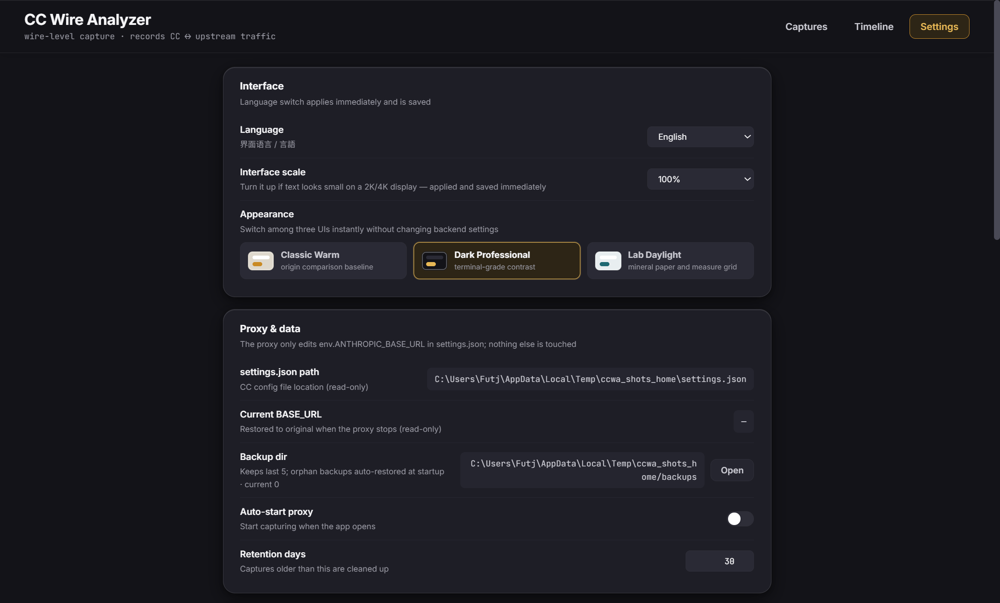

# CC Wire Analyzer

Record and inspect every HTTP request **Claude Code** makes. A local MITM proxy that captures the full request and response between CC and its upstream endpoint — filling the wire-level gap that `~/.claude/projects/*.jsonl` (CC's post-processed view) and OTLP telemetry can't show.

[中文](README.zh.md) · [日本語](README.ja.md)

[Releases](../../releases) · [Changelog](CHANGELOG.md)

> First time here? All docs are in Chinese.
> **[docs/界面导览.md](docs/界面导览.md)** — what humans see in the UI ·
> **[docs/报文解读.md](docs/报文解读.md)** — what Claude Code actually sends ·
> **[docs/AI_USAGE.md](docs/AI_USAGE.md)** — for AI agents driving the tool ·
> **[docs/架构总览.md](docs/架构总览.md)** — how the app is built ·
> **[docs/开发指南.md](docs/开发指南.md)** — read this before changing code ·
> **[docs/问题域手册.md](docs/问题域手册.md)** — building the same tool for another agent harness ·
> **[docs/文档维护策略.md](docs/文档维护策略.md)** — how these docs stay in sync.
> *(Deep-dive docs are in Chinese; machine-translate if needed.)*

## When you'd reach for this

Claude Code shows you its own version of a session. The wire shows what was actually sent and
what actually came back — and the two are not the same thing. You'd reach for the wire when you
want to understand the real conversation between CC and the model:

- **See exactly what CC sends to the model.** The full system prompt as transmitted (watermark
  fields and all), which tools were declared on which request, when a subagent was spawned and
  with what prompt, the background security-classifier calls you never see, SSE chunk timing,
  and token counts as the upstream reported them — not as they were later summarized.
- **Read the prompts behind every stage.** CC isn't one conversation — it's main chat plus
  title generation, security review, and context compaction, each with its own system prompt and
  tool list. The wire lays them out side by side: what the main system prompt actually says, how
  tool descriptions are worded, how a user message gets wrapped and injected, how a subagent's
  prompt differs from the one that spawned it. The prompt engineering is right there on the page.
- **Hand it to an agent to analyze.** Everything is written to plain JSONL on your machine, and
  the same endpoints the GUI uses are open over HTTP — so you (or another agent) can walk back
  through a session afterwards, search it, cross-analyze it, instead of trying to reproduce the
  moment.

## Screenshots

| Captures | Timeline DAG |
|---|---|
|  |  |

| Request detail | Settings |
|---|---|
|  |  |

## A real example: hand the recording to an agent

Session titles had stopped generating. Claude Code showed no error — titles simply never
appeared. Instead of hunting for it by eye, you point an agent at the tool:

> Read `http://127.0.0.1:<port>/api/ai-guide`, then find out why session titles aren't being
> generated.

The agent walks the endpoints itself — `GET /api/diagnose/errors` to see the day's failures
grouped by upstream message, then `GET /api/captures/<id>` on a sample — and comes back with
the upstream's actual answer:

```
output_config.effort 'max' is not supported when thinking is disabled on this model.
Use effort 'high' or below, or enable thinking.
```

The cause was a config contradiction: `settings.json` had `effortLevel: low` at the top level,
while the environment set `CLAUDE_CODE_EFFORT_LEVEL: max` — and the environment wins. Nothing in
CC's own view showed this; the failing requests were only visible at the wire layer. One agent
call, one answer — no eyeballing the timeline, no reproducing the moment.

That same finding can be turned into a check (the built-in config health-check does exactly
this), but the point here is the loop the tool is built around: **the recording is
machine-readable, and the failures in it have already been diagnosed once by the upstream — an
agent can read that diagnosis back out without you in the middle.**

## Is it safe to point your traffic at it?

Reasonable question to ask of anything calling itself a MITM proxy. The honest answer, in four
points:

- **No recording leaves your machine.** Recordings are written to `~/.cc-wire-analyzer/` as plain
  JSONL, and traffic is forwarded to the same upstream CC was already using. There is no
  telemetry, no account, no upload. The app makes exactly two outbound calls of its own, both
  only when you click them: the optional translate / ask-AI feature in the detail view (sends the
  selected content to an endpoint **you** configure) and "check for updates" in the About panel
  (asks api.github.com for the latest release tag, sends nothing about you).
- **One config field, restored on exit.** The proxy edits `ANTHROPIC_BASE_URL` in
  `~/.claude/settings.json` and nothing else — token, model mapping and OTLP config are left
  alone. The file is backed up before the edit, and restoration is hooked to the window-close
  event, `atexit`, signals, and a startup orphan check; a `restore` command exists as a last
  resort. Restoration only ever undoes the exact change it can still prove it made — if you or
  cc-switch changed `BASE_URL` in the meantime, it leaves your file alone.
- **Credentials are redacted, message content is not.** `Authorization` and similar headers are
  stored redacted. Request and response bodies are stored **verbatim** — which is the point, but
  it means a recording contains your prompts, your files' contents as quoted into the session,
  and the full system prompt. Treat capture files as sensitive: don't paste them into a chat or
  attach them to a bug report without reading them first.
- **It coexists with your existing setup.** Official endpoint direct, a third-party gateway, or
  cc-switch — all supported. While the proxy is running, don't switch endpoints with cc-switch:
  that rewrites `BASE_URL` and CC would bypass the proxy. The app watches for exactly this and
  tells you when it happens. Also avoid cc-switch's "save current as profile" while recording —
  it would read the patched settings and store the local-proxy address into that profile, so
  switching to it later points CC at a dead port (the app can't prevent this; settings.json is
  only read, not changed). And if `BASE_URL` is already a local address when recording starts
  (leftover from a previous run, or a contaminated profile), the app warns you to check it.

## Features

- **Zero intrusion** — only edits `ANTHROPIC_BASE_URL` in `~/.claude/settings.json`; token, model mapping, OTLP config all preserved. Closing the app byte-restores the file.
- **Works with official-direct and third-party endpoints** — no `ANTHROPIC_BASE_URL` (direct to Anthropic) works too, falling back to capture the official endpoint; if present, follows it (e.g. a gateway configured via [cc-switch](https://github.com/farion1231/cc-switch)).
- **Transparent streaming** — SSE is forwarded while recorded; CC feels identical to a direct connection.
- **Crash protection** — atomic writes + per-start backup + atexit/signal/excepthook triple restore + orphan-backup recovery.
- **Timeline DAG** — swimlane view; each main session gets its own color across the lane header, axis, node border, and edges; subagent/auxiliary nodes carry a dot in their related session's color so you can see what spawned what at a glance.
- **Detail tools** — translate, "ask AI what this does" (with prompt-injection guard), format/pretty-print; UI supports **Chinese / English / Japanese** switch (instant, persisted).
- **Clear recordings** — clear a day's captures (direct delete / archive-to-zip then delete), with inline two-step confirm.
- **Blind-spot radar** — `GET /api/unknowns` flags every protocol value the tool doesn't yet recognize (new block types/fields, unhandled request fields, non-standard enums, the beta-feature tail), each with a content snippet and the beta features it appears alongside. It's the early warning when Claude Code ships a new beta — and, when porting the analyzer to another agent harness, the discovery tool that turns "guess the new protocol" into "scan once, confirm each unknown, build that harness's known set".
- **Cross-platform** — Windows `.exe` and macOS `.app`, built via GitHub Actions. **Fonts are bundled** (Inter + JetBrains Mono + Noto Sans SC) so the UI looks identical on every machine.

## Quick start

### Option A — download a release build

Grab the latest `cc-wire-analyzer-windows.exe` or `cc-wire-analyzer-macos.zip` from [Releases](../../releases). No Python needed.

- **Windows**: double-click the `.exe`. If it warns about WebView2 missing, install [Microsoft Edge WebView2 Runtime](https://developer.microsoft.com/microsoft-edge/webview2/).
- **macOS**: unzip, drag `cc-wire-analyzer.app` to `/Applications`. The app is **unsigned and un-notarized** (normal for a free open-source project — code-signing costs $99/year), so **Gatekeeper blocks the first launch**. Allow it once:
  - Right-click `cc-wire-analyzer.app` → **Open** → confirm **Open** in the dialog; **or**
  - On newer macOS where that's unavailable: **System Settings → Privacy & Security → scroll to the bottom → click "Open Anyway"**.
  - After the first launch, it opens normally with no further prompts. (This is an Apple security measure, not a problem with the app.)

### Option B — run from source

```bash
git clone <this-repo> && cd cc-wire-analyzer
uv sync                 # Windows
uv sync --extra mac     # macOS (installs pyobjc)
uv run python src/desktop.py
```

Then click **Start proxy** in the app, open a new Claude Code session, use it normally — traffic appears in the captures list.

## How it works (the 30-second version)

1. You click **Start proxy**.
2. The app backs up `~/.claude/settings.json`, then sets `ANTHROPIC_BASE_URL` to `http://127.0.0.1:<port>` (one field, nothing else touched).
3. Claude Code now sends all requests to the local proxy, which records (JSONL, headers redacted) and forwards them to the real upstream.
4. You click **Stop proxy** (or close the app) → `ANTHROPIC_BASE_URL` is restored byte-for-byte.

While the proxy runs, **don't switch endpoints with cc-switch** — it rewrites `BASE_URL` and CC would bypass the proxy.

## If Claude Code shows API errors

Recording works by temporarily pointing `ANTHROPIC_BASE_URL` at the local proxy, and the app
restores it on exit (multiple safety nets + an orphan-marker self-heal). If CC still reports
API errors after a recording — connection refused, 401, timeouts — it's almost always a stale
or wrong `BASE_URL` left in `~/.claude/settings.json`. Fix it by endpoint type:

- **Third-party API / gateway**: open `~/.claude/settings.json` and set `ANTHROPIC_BASE_URL`
  back to your gateway's address (or switch it back with cc-switch).
- **Official Anthropic subscription**: **delete** the `ANTHROPIC_BASE_URL` field entirely —
  the official endpoint needs no base URL — then **fully quit and restart Claude Code**. CC
  reads `BASE_URL` only at startup, so editing the file while it runs won't take effect.

## Data location

| Path | Content |
|------|---------|
| `~/.cc-wire-analyzer/captures/<YYYY-MM-DD>.jsonl` | Request/response recordings (append-only) |
| `~/.cc-wire-analyzer/archives/<date>.<HHMMSS>.jsonl.zip` | Archived recordings (when you "archive then clear") |
| `~/.cc-wire-analyzer/backups/settings.json.<ts>` | settings.json backups (keeps last 5) |
| `~/.cc-wire-analyzer/config.json` | App config (ui_lang / translate / explain …) |
| `~/.cc-wire-analyzer/run.log` | Run log |

## For AI agents: drive it over HTTP

This tool is not only for humans to look at — **an agent can drive it too**. One binary, three calls:

- `cc-wire-analyzer.exe` (double-click) → opens the GUI
- `cc-wire-analyzer.exe serve` → starts a **background HTTP service + the proxy**, no window, for an agent
- `cc-wire-analyzer.exe --help` → prints the full usage guide and exits (no window)

**The manual ships inside the binary.** You do not need this repository to use the tool from an
agent: `--help` prints the guide, and once the service is up, `GET /api/ai-guide` returns the same
text plus this machine's runtime facts (actual port, absolute data paths, whether it is recording).
So the whole handoff to your own agent is one sentence:

> This machine is running CC Wire Analyzer. Read `http://127.0.0.1:<port>/api/ai-guide` and drive it
> from there. (The port is in `~/.cc-wire-analyzer/port.txt`.)

Talk to it over HTTP on `127.0.0.1` — the same endpoints the GUI uses:

```bash
cc-wire-analyzer.exe serve &                     # start the service + proxy (patches settings.json)
port=$(cat ~/.cc-wire-analyzer/port.txt)
curl 127.0.0.1:$port/api/proxy/status            # is it recording?
# …run the session you want to record…
curl -X POST 127.0.0.1:$port/api/proxy/stop
curl "127.0.0.1:$port/api/captures?date=2026-07-13"
```

One capture can exceed 5 MB, so fetch summaries first and single records by id. Full reference,
record schema, and safety notes: **[docs/AI_USAGE.md](docs/AI_USAGE.md)**.

On macOS it's the same single binary — `cc-wire-analyzer.app/Contents/MacOS/cc-wire-analyzer serve`.

## Optional: translate / ask-AI

The detail page can translate text or explain "what does this content do" via any OpenAI-compatible `/chat/completions` endpoint. Configure API key / base URL / model in **Settings → LLM model**. The explain feature has a built-in injection guard (the untrusted captured content is wrapped in delimiters; literal closing tags are escaped; the isolation frame is hardcoded and unaffected by your custom prompt).

## Build from source

Build steps live in [CONTRIBUTING.md](CONTRIBUTING.md#building) — kept in one place so the Windows
and macOS instructions can't drift apart. Releases are built automatically by
[`.github/workflows/release.yml`](.github/workflows/release.yml) on every `v*` tag.

## Relationship to other observability tools

This tool covers the **wire level** (raw HTTP). It pairs well with jsonl-based conversation analyzers (CC's own view) and OTLP telemetry (metrics view) — the three are complementary.

## License

- Code: **MIT**.
- Documentation and prose (README / docs / in-app text): **CC BY 4.0** — credit the source if you reuse it.
- Bundled fonts (Inter / JetBrains Mono / Noto Sans SC): **SIL OFL 1.1**.
- Bundled JS (marked.js: MIT; DOMPurify: Apache-2.0/MPL-2.0).

Full text in [LICENSE](LICENSE). See [CONTRIBUTING.md](CONTRIBUTING.md) for development setup.
