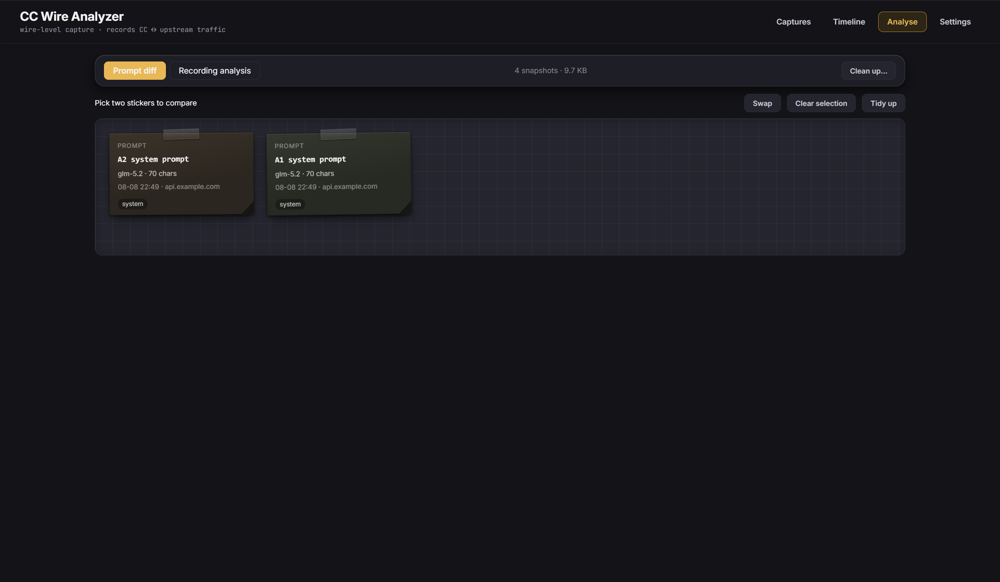

# CC Wire Analyzer — Understand Claude Code's Prompts, Thinking, and Subagent Behavior

Claude Code tells you what it did, but often you need to know why: which hidden call failed, what automatic mode is waiting for, what prompt a subagent received, or what system prompt the model actually saw.

CC Wire Analyzer records requests and responses between Claude Code and its upstream locally, then organizes that behind-the-scenes activity into a capture list, request details, a timeline, and comparable snapshots. Inspect it yourself, or let an agent search and analyze it directly.

[中文](README.zh.md) · [日本語](README.ja.md)

[Website](https://fuhehe12.github.io/cc-wire-analyzer/) · [Download the latest release](https://github.com/FuHehe12/cc-wire-analyzer/releases/latest) · [Documentation](docs/README.md) · [Changelog](CHANGELOG.md)

**Windows and macOS · Chinese, English, and Japanese UI · Optional translation and AI explanation · Recordings stored locally**

## What can it help you diagnose?

- **Safety classifier or hidden-call errors**: Find the failed request and inspect the actual upstream error, along with the related prompt, model settings, and tool calls.
- **Automatic mode suddenly slows down**: Compare total duration and time to first token to determine whether Claude Code is thinking, retrying, or stuck on an auxiliary request such as title generation, a safety review, or token counting.
- **You want to see what the model actually received**: Expand the complete system prompt, Messages, tool definitions, and thinking. Translate English or mixed-language content in place while keeping the original beside it.
- **Subagent behavior is hard to follow**: Use the timeline to see who spawned whom, which prompt Task/Agent used, and what context each subagent received.
- **The problem is better handed to an agent**: Recordings are machine-readable JSONL, and a local HTTP API is available. An agent can search, compare, and group errors without making you inspect every request manually.

## Get started in 3 minutes

1. Download and open the Windows or macOS build from [Releases](../../releases).
2. On the **Captures** tab, click **Start proxy**, then open a new Claude Code session.
3. Use Claude Code normally and reproduce the behavior you want to investigate.
4. Return to CCWA. Find the suspicious request in the capture list, then open its details or the timeline. You can also have an agent read the local analysis API directly.

When you are done, click **Stop proxy** or close the app.

## Screenshots

| Capture list | Capture detail: System, thinking, and translation |
|---|---|
|  |  |

| Timeline DAG | Analyse: snapshots and diff |
|---|---|
|  |  |

## How to analyze a capture

### 1. Find the suspicious request in the capture list

Each row in the capture list is one upstream request. Start with four signals:

| Signal | What it tells you |
|---|---|
| Type | How often main, title generation, safety review, subagent, context compaction, and other calls occurred |
| Total duration / time to first token | Whether the request is waiting for the first response or the generation itself is slow |
| Tokens / cache | Which turn suddenly grew in context size and whether the cache was read repeatedly |
| Status / summary | Upstream errors, review results, and response summaries; red failures are usually the most direct clue |

If automatic mode slows down, find the timing outlier first. If a safety classifier is involved, start with the safety or failed rows instead of guessing from the whole session.

### 2. Open the details to see what the model actually received

Select a request, then expand the section relevant to your question:

- **System**: The complete system prompt, identity declarations, context reminders, and cache attributes.
- **Messages**: User messages, conversation history, tool results, and context injected by Claude Code.
- **Content Blocks**: thinking, text, tool_use, errors, and stop reasons.
- **Tools**: The tools declared to the model for this request and the complete schema for each one.

You can copy, format, translate, or ask your configured AI to explain any text block. Translations and explanations appear beside the original so you can verify them instead of replacing the source content.

### 3. Use Timeline and Analyse to connect requests

- **Timeline** places main sessions, subagents, and auxiliary calls in separate lanes. Follow derivation edges to see who spawned whom, then use the time axis to find waits, retries, and repeated failures.
- **Analyse** lets you save a complete request or a prompt segment as a snapshot, then compare prompts, context, thinking, and invisible-character differences across turns.

### 4. Let an agent help with the analysis

If the issue spans many requests, you do not need to open them one by one. CCWA's GUI and agents use the same local API. Once the service is running, tell the agent to start here:

> CC Wire Analyzer is running on this machine. Read `http://127.0.0.1:<port>/api/ai-guide` and follow its instructions to inspect failures, slow requests, and subagent behavior in this recording.

The port is stored in `~/.cc-wire-analyzer/port.txt`. An agent can inspect summaries and grouped errors first, then fetch individual request details by ID. See the [AI usage guide](docs/reference/AI_USAGE.md) for the complete workflow.

## Core capabilities

- **Transparent capture**: Forwards SSE while recording it; supports direct connections to the official Anthropic endpoint and compatible third-party endpoints.
- **Complete request details**: Preserves requests, responses, system prompts, Messages, tools, thinking, token usage, and upstream errors.
- **Call relationships**: Connects main sessions, subagents, and auxiliary calls in a timeline DAG.
- **Content analysis**: Supports formatting, translation, AI explanations, snapshots, precise diffs, and layered views of the reasoning chain.
- **Machine-readable data**: Local JSONL, an HTTP API, and a CLI support search, statistics, and automated diagnosis.
- **Cross-platform desktop app**: Ships as a Windows `.exe` and macOS `.app`; no Python installation required.

## Install and run

### Download a release

Download the latest Windows executable or macOS archive from [Releases](../../releases).

- **Windows**: Double-click the `.exe`. If Windows reports that WebView2 is missing, install the [Microsoft Edge WebView2 Runtime](https://developer.microsoft.com/microsoft-edge/webview2/).
- **macOS**: Unzip the archive and drag the app into `/Applications`. The app is not yet signed or notarized. On first launch, right-click it and choose **Open**, or go to **System Settings → Privacy & Security** and choose **Open Anyway**.

### Run from source

```bash
git clone https://github.com/FuHehe12/cc-wire-analyzer.git
cd cc-wire-analyzer
uv sync                 # Windows
uv sync --extra mac     # macOS
uv run python src/desktop.py
```

## Learn more

This README covers only what you need for your first session. For implementation details, network forwarding, data locations, configuration recovery, the complete API, and development conventions, see:

- [Documentation index](docs/README.md)
- [UI guide](docs/reference/界面导览.md)
- [Use an agent to drive CCWA](docs/reference/AI_USAGE.md)
- [API contract](docs/reference/API契约.md)
- [Architecture overview](docs/reference/架构总览.md)
- [Contributing and building](CONTRIBUTING.md)

## License

- Code: **MIT**.
- README, docs, and in-app copy: **CC BY 4.0**.
- See [THIRD_PARTY_NOTICES](THIRD_PARTY_NOTICES) for licenses covering fonts and bundled dependencies.

See [LICENSE](LICENSE) and [LICENSE-DOCS](LICENSE-DOCS) for full terms.
