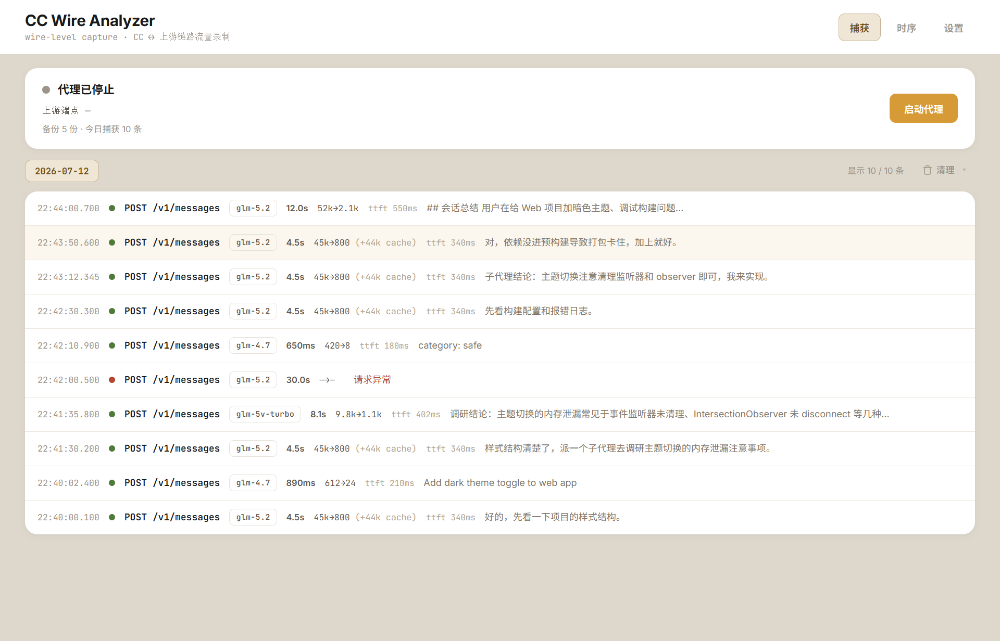
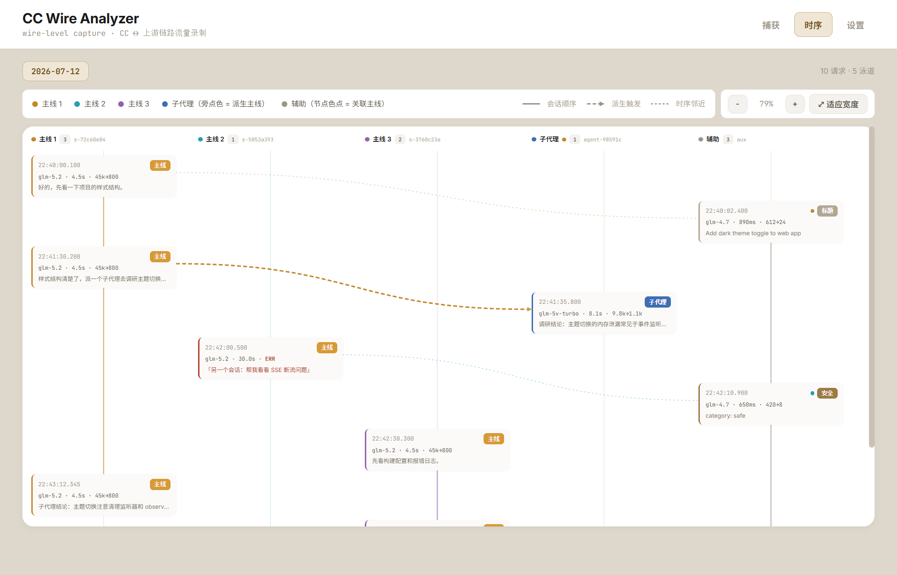
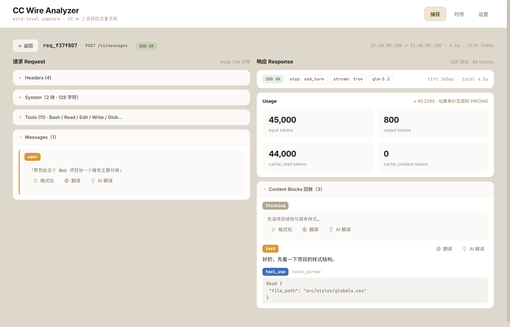
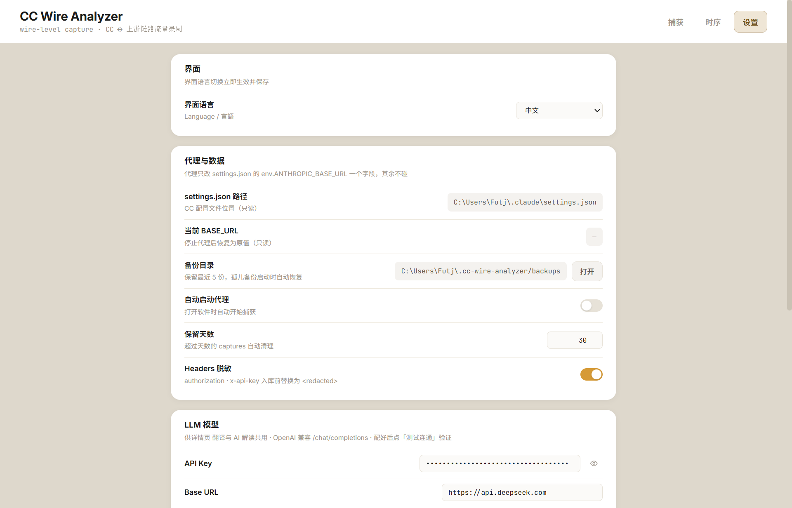

# CC Wire Analyzer

本地 MITM 代理桌面应用，透明转发并**完整录制** Claude Code ↔ 上游端点的全部 HTTP 流量——填补 `~/.claude/projects/*.jsonl`（CC 的已加工视图）和 OTLP 遥测都看不到的链路级维度。

[English](README.md) · [日本語](README.ja.md)

## 它能让你看到原本看不到的东西

Claude Code 与上游（Anthropic 官方或第三方网关）通信时，发出的请求里藏着 jsonl/OTLP 抓不到的链路级真相：system prompt 里原始的水印字段、SSE 分块时序、上游的确切响应、安全分类器调用、精确的 token 成本。本工具起一个本地代理，临时把 CC 的 `ANTHROPIC_BASE_URL` 指向它，**边录制边转发**全部流量——让这些真相变得可观测。

## 截图

| 捕获列表 | 时序 DAG |
|---|---|
|  |  |

| 请求详情 | 设置 |
|---|---|
|  |  |

## 特性

- **零侵入** —— 只改 `~/.claude/settings.json` 的 `ANTHROPIC_BASE_URL`，token、模型映射、OTLP 配置全保留。关闭软件时字节级复原该文件。
- **官方直连与第三方端点都支持** —— 没有 `ANTHROPIC_BASE_URL`（直连 Anthropic）也能用，自动回退抓官方端点；有则跟随（例如用 [cc-switch](https://github.com/farion1231/cc-switch) 配的网关）。
- **透明流式** —— SSE 边转发边录制，CC 用起来和直连完全一样。
- **崩溃保护** —— 原子写 + 每次启动备份 + atexit/signal/excepthook 三重恢复 + 孤儿备份恢复。
- **时序 DAG** —— 泳道视图；每条主线会话在泳道头、轴线、节点边框、连线上都用各自颜色；子代理/辅助节点带关联主线颜色的点，一眼看出谁派生了谁。
- **详情工具** —— 翻译、"问 AI 这是什么意思"（带提示词注入防护）、格式化/美化；界面支持**中文/英文/日文**切换（即时、持久化）。
- **清理录制** —— 清掉某天的捕获（直接删除 / 压缩存档后删除），内联二次确认。
- **跨平台** —— Windows `.exe` 和 macOS `.app`，由 GitHub Actions 构建。**字体全打包**（Inter + JetBrains Mono + Noto Sans SC），每台机器上界面都长得一样。

## 快速开始

### 方式 A —— 下载 release 构建

从 [Releases](../../releases) 下载最新的 `cc-wire-analyzer-windows.exe` 或 `CCWireAnalyzer-mac.zip`。不需要 Python。

- **Windows**：双击 `.exe`。如果提示 WebView2 缺失，装一下 [Microsoft Edge WebView2 Runtime](https://developer.microsoft.com/microsoft-edge/webview2/)。
- **macOS**：解压，把 `CCWireAnalyzer.app` 拖到 `/Applications`。首次启动右键 → 打开（应用未签名，Gatekeeper 会提示）。

### 方式 B —— 源码运行

```bash
git clone <this-repo> && cd cc-wire-analyzer
uv sync                 # Windows
uv sync --extra mac     # macOS（装 pyobjc）
uv run python src/desktop.py
```

然后在软件里点**启动代理**，新开一个 Claude Code 会话，正常使用——流量就出现在捕获列表里。

## 工作原理（30 秒版）

1. 你点**启动代理**。
2. 软件备份 `~/.claude/settings.json`，然后把 `ANTHROPIC_BASE_URL` 设成 `http://127.0.0.1:<端口>`（只这一字段，其他不动）。
3. Claude Code 此后所有请求都发给本地代理，代理录制（JSONL，headers 脱敏）并转发给真正的上游。
4. 你点**停止代理**（或关闭软件）→ `ANTHROPIC_BASE_URL` 字节级复原。

代理运行期间，**不要用 cc-switch 切换端点** —— 它会重写 `BASE_URL`，CC 就绕过代理了。

## 数据位置

| 路径 | 内容 |
|------|---------|
| `~/.cc-wire-analyzer/captures/<YYYY-MM-DD>.jsonl` | 请求/响应录制（只追加） |
| `~/.cc-wire-analyzer/archives/<date>.<HHMMSS>.jsonl.zip` | 归档录制（选"压缩存档后删除"时） |
| `~/.cc-wire-analyzer/backups/settings.json.<ts>` | settings.json 备份（留最近 5 份） |
| `~/.cc-wire-analyzer/config.json` | 应用配置（ui_lang / translate / explain…） |
| `~/.cc-wire-analyzer/run.log` | 运行日志 |

## 可选：翻译 / 问 AI

详情页可以通过任何 OpenAI 兼容的 `/chat/completions` 端点翻译文本或解读"这段内容在干什么"。在**设置 → LLM 模型**里配 API key / base URL / model。解读功能内置注入防护（不可信的捕获内容被定界符包裹；字面闭合标签被转义；隔离框架是硬编码的，不受你的自定义提示词影响）。

## 源码构建

- **Windows**：`uv run pyinstaller build.spec`
- **macOS**：`uv sync --extra mac && uv run pyinstaller build-mac.spec`

Release 由 [`.github/workflows/release.yml`](.github/workflows/release.yml) 在每个 `v*` tag 上自动构建。

## 和其他可观测性工具的关系

本工具覆盖**链路层**（原始 HTTP）。它和基于 jsonl 的对话分析器（CC 自己的视图）、OTLP 遥测（指标视图）配合得很好——三者互补。

## 许可证

- 代码：**MIT**。
- 文档与文字（README / docs / 界内文字）：**CC BY 4.0** —— 复用时请注明出处。
- 打包字体（Inter / JetBrains Mono / Noto Sans SC）：**SIL OFL 1.1**。
- 打包 JS（marked.js：MIT；DOMPurify：Apache-2.0/MPL-2.0）。

全文见 [LICENSE](LICENSE)（英文）。API 契约等技术文档见 [docs/API契约.md](docs/API契约.md)（中文）。
