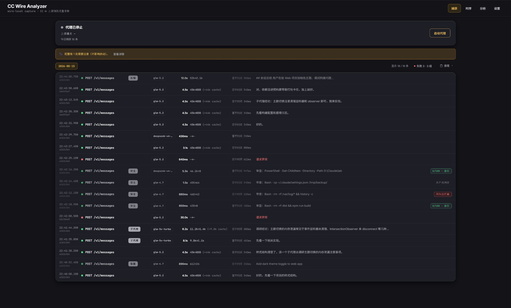
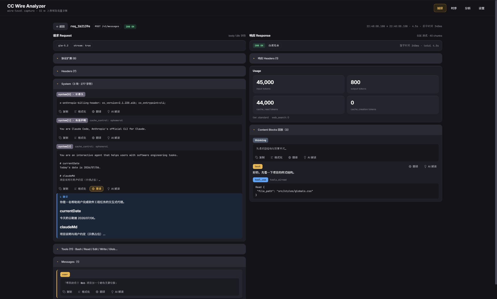

# CC Wire Analyzer — 看懂 Claude Code 的提示词、思考过程与子代理行为

Claude Code 告诉你“做了什么”，但很多时候你更想知道“为什么”：哪次隐藏调用失败了，自动模式在等什么，子代理拿到了什么提示词，模型实际收到的 system prompt 又是什么。

CC Wire Analyzer 在本机录下 Claude Code 与上游之间的请求和响应，把这些幕后过程整理成捕获列表、请求详情、时序图和可比较的快照。你可以自己查看，也可以直接交给 agent 检索和分析。

[English](README.md) · [日本語](README.ja.md)

[官网](https://fuhehe12.github.io/cc-wire-analyzer/zh/) · [下载最新版](https://github.com/FuHehe12/cc-wire-analyzer/releases/latest) · [使用文档](docs/README.md) · [更新日志](CHANGELOG.zh.md)

**支持 Windows 与 macOS · 中文/英文/日文界面 · 可选翻译与 AI 解读 · 录制保存在本机**

## 它能帮你解决什么问题

- **安全分类器或隐藏调用报错**：找到失败请求，查看上游返回的真实错误，以及它关联的提示词、模型设置和工具调用。
- **自动模式突然变慢**：比较总耗时和首字时间，判断是在思考、重试，还是卡在标题生成、安全审查、Token 统计等辅助请求上。
- **想看模型实际收到的内容**：展开完整的 system prompt、Messages、工具定义和 thinking；英文或混合语言内容可以直接翻译，并保留原文对照。
- **子代理行为难以理解**：沿时序图查看谁派出了谁、Task/Agent 使用了什么 prompt、每个子代理拿到了哪些上下文。
- **问题适合交给 agent 深挖**：录制是机器可读的 JSONL，同时提供本地 HTTP API；agent 可以搜索、比较、归并错误，无需你手工逐条翻看。

## 3 分钟上手

1. 从 [Releases](../../releases) 下载并打开 Windows 或 macOS 版本。
2. 在「捕获」页点击「启动代理」，然后新开一个 Claude Code 会话。
3. 正常使用 Claude Code，重现一次你想调查的现象。
4. 回到 CCWA：先在捕获列表定位可疑请求，再打开详情或时序图；也可以让 agent 直接读取本地分析接口。

调查结束后点击「停止代理」或关闭软件即可。

## 截图

| 录制列表 | 录制详情：System、thinking 与翻译 |
|---|---|
|  |  |

| 时序 DAG | Analyse：快照与对比 |
|---|---|
|  |  |

## 如何分析一条录制

### 1. 从捕获列表定位异常请求

捕获列表中的每一行都是一条上游请求。先看四类信号：

| 信号 | 可以看出什么 |
|---|---|
| 类型 | 主线、标题生成、安全审查、子代理、上下文压缩等调用分别发生了多少次 |
| 总耗时 / 首字时间 | 请求是在等待首个响应，还是生成过程本身很慢 |
| Token / 缓存 | 哪一轮上下文突然变大，缓存是否反复读取 |
| 状态 / 摘要 | 上游错误、审查结果和响应摘要；红色失败通常是最直接的线索 |

例如，自动模式变慢时先找耗时异常的行；安全分类器有问题时先找「安全」或失败行，不必从整段会话里盲猜。

### 2. 打开详情，看模型真正收到了什么

点击一条请求后，按问题展开对应区域：

- **System**：完整 system prompt、身份声明、上下文 reminder 和缓存属性。
- **Messages**：用户消息、历史对话、工具结果，以及 Claude Code 注入的上下文。
- **Content Blocks**：thinking、text、tool_use、错误与停止原因。
- **Tools**：该次请求向模型声明了哪些工具，以及工具 schema 的具体内容。

每个文本块都可以复制、格式化、翻译或交给你配置的 AI 解读。翻译和解读结果显示在原文旁边，方便核对，而不是替换原始内容。

### 3. 用时序图和 Analyse 查看跨请求关系

- **时序**页把主线、子代理和辅助调用放进不同泳道。沿派生边查看谁派出了谁，沿时间轴寻找等待、重试和连续失败。
- **Analyse** 页可以把整条请求或一段提示词保存为快照，再比较不同轮次的提示词、上下文、thinking 和不可见字符差异。

### 4. 让 agent 辅助分析

如果问题跨越很多请求，不必手工逐条打开。CCWA 的 GUI 和 agent 使用同一套本地接口；服务启动后，让 agent 先读：

> 这台机器上运行着 CC Wire Analyzer。读取 `http://127.0.0.1:<端口>/api/ai-guide`，按说明检查这次录制中的失败、慢请求和子代理行为。

端口记录在 `~/.cc-wire-analyzer/port.txt`。agent 可以先查摘要和错误聚合，再按 id 读取单条详情；完整工作流见 [AI 使用文档](docs/reference/AI_USAGE.md)。

## 核心能力

- **透明录制**：SSE 边转发边记录；支持 Anthropic 官方直连和第三方兼容端点。
- **完整详情**：保留请求、响应、system prompt、Messages、工具、thinking、Token 用量和上游错误。
- **调用关系**：用时序 DAG 连接主线、子代理和辅助调用。
- **内容分析**：支持格式化、翻译、AI 解读、快照、精确对比和思考链分层查看。
- **机器可读**：本地 JSONL、HTTP API 和 CLI 都可以用于搜索、统计与自动诊断。
- **跨平台桌面应用**：提供 Windows `.exe` 和 macOS `.app`，无需安装 Python。

## 安装与运行

### 下载发行版

从 [Releases](../../releases) 下载最新的 Windows 可执行文件或 macOS 压缩包。

- **Windows**：双击 `.exe`。如果系统提示缺少 WebView2，请安装 [Microsoft Edge WebView2 Runtime](https://developer.microsoft.com/microsoft-edge/webview2/)。
- **macOS**：解压后把应用拖入 `/Applications`。应用尚未签名和公证，第一次启动需要右键选择「打开」，或在「系统设置 → 隐私与安全性」中选择「仍要打开」。

### 从源码运行

```bash
git clone https://github.com/FuHehe12/cc-wire-analyzer.git
cd cc-wire-analyzer
uv sync                 # Windows
uv sync --extra mac     # macOS
uv run python src/desktop.py
```

## 深入了解

README 只保留第一次使用需要的信息。实现原理、网络转发、数据位置、配置恢复、完整 API 和开发约定请按需查看：

- [文档索引](docs/README.md)
- [界面导览](docs/reference/界面导览.md)
- [用 agent 驱动 CCWA](docs/reference/AI_USAGE.md)
- [API 契约](docs/reference/API契约.md)
- [架构总览](docs/reference/架构总览.md)
- [参与开发与构建](CONTRIBUTING.md)

## 许可证

- 代码：**MIT**。
- README、docs 与应用内文字：**CC BY 4.0**。
- 字体及打包依赖的许可证见 [THIRD_PARTY_NOTICES](THIRD_PARTY_NOTICES)。

详细条款见 [LICENSE](LICENSE) 与 [LICENSE-DOCS](LICENSE-DOCS)。
