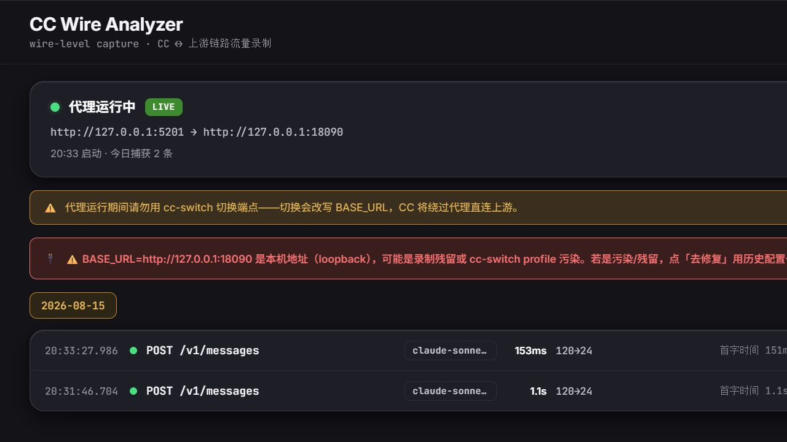
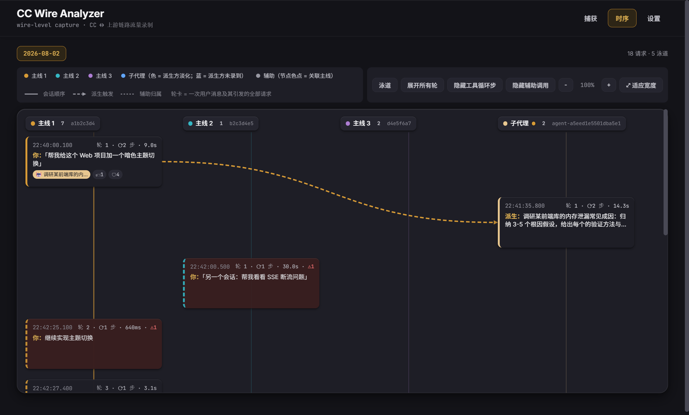
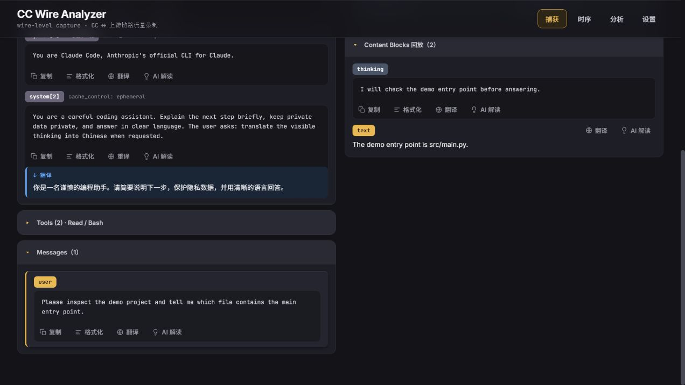
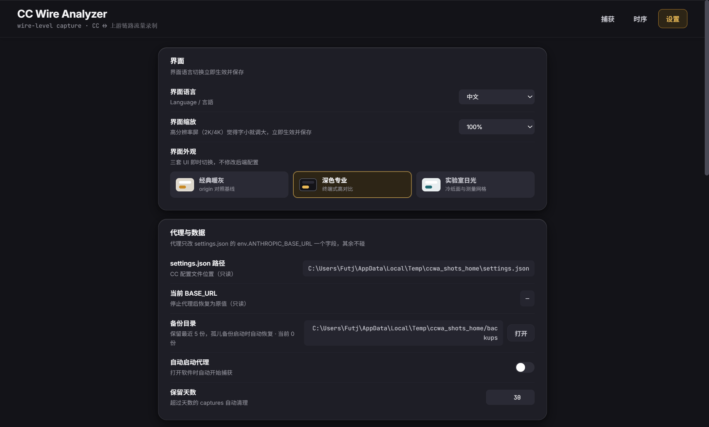
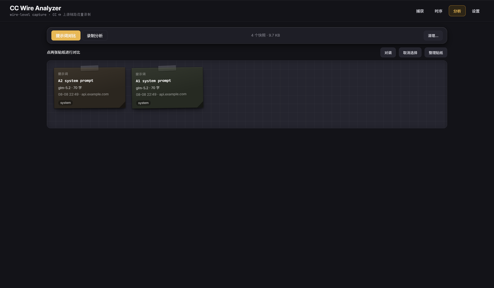

# CC Wire Analyzer

录制并查看 **Claude Code** 发出的每一个 HTTP 请求。本地 MITM 代理透明转发并**完整录制** CC ↔ 上游端点的请求与响应——填补 `~/.claude/projects/*.jsonl`（CC 的已加工视图）和 OTLP 遥测都看不到的链路级维度。

[English](README.md) · [日本語](README.ja.md)

[发版列表](../../releases) · [更新日志](CHANGELOG.zh.md)

> 第一次来？按你想干什么挑一份：
> **[docs/reference/界面导览.md](docs/reference/界面导览.md)** 人在 UI 里能看到什么 ·
> **[docs/methodology/报文解读.md](docs/methodology/报文解读.md)** Claude Code 到底发了什么出去 ·
> **[docs/reference/AI_USAGE.md](docs/reference/AI_USAGE.md)** 用 AI agent 驱动本工具 ·
> **[docs/reference/架构总览.md](docs/reference/架构总览.md)** 这个软件怎么搭起来的 ·
> **[docs/reference/开发约定.md](docs/reference/开发约定.md)** 改代码前必读 ·
> **[docs/methodology/同类工具构建手册.md](docs/methodology/同类工具构建手册.md)** 想给别的 agent 工具做同类分析器 ·
> **[docs/文档维护策略.md](docs/文档维护策略.md)** 这些文档怎么保持同步。

## 什么时候你会需要它

Claude Code 展示的是它自己视角下的会话；wire 层展示的是实际发出去了什么、实际收回来了什么——这两件事并不相同。当你想看清 CC 和模型之间真实的交互，你会需要 wire 层：

- **看清 CC 到底给模型发了什么。** 完整的 system prompt 原文（连同水印字段）、每条请求声明了哪些工具、子代理在何时以何种 prompt 被派生、你从未见过的后台安全分类器调用、SSE 分块时序，以及上游报告的原始 token 数——而非事后被归纳过的版本。
- **读懂每个环节的提示词怎么写。** CC 不是一个对话——它是主线对话，加上标题生成、安全审查、上下文压缩，每个环节都有自己的 system prompt 和工具列表。wire 层把它们并排摊开：主线的 system prompt 到底说了什么、工具描述是怎么措辞的、user 消息怎么被包裹注入、子代理的 prompt 和派生它的主线有什么不同。提示词工程一目了然。
- **交给 agent 去分析。** 一切以纯 JSONL 写在本机，GUI 用的那套端点也对外开放 HTTP——你（或另一个 agent）可以事后逐条翻查、搜索、交叉分析，而不必尝试复现那一刻。

## 截图

| 捕获列表 | 时序 DAG |
|---|---|
|  |  |

| 请求详情 | 设置 |
|---|---|
|  |  |

| 分析 —— 快照与对比 |
|---|
|  |

截图用的是 v0.4.7 起的默认外观「深色专业」。设置页还有「经典暖灰」（v0.4.7 之前的界面）与
「实验室日光」；外观只属于界面本地，不会碰你的代理配置。

## 一个真实例子：把录制交给 agent

会话标题一直没生成，而 Claude Code 未报任何错误——标题就是不出现。不必用眼睛到处翻，你把工具指给一个 agent：

> 读 `http://127.0.0.1:<端口>/api/ai-guide`，然后查清楚会话标题为什么生成不出来。

agent 自己走端点——`GET /api/diagnose/errors` 看当天失败按上游消息归并的结果，再 `GET /api/captures/<id>` 取一条样本——然后带着上游的真实回答回来：

```
output_config.effort 'max' is not supported when thinking is disabled on this model.
Use effort 'high' or below, or enable thinking.
```

根因是一处配置矛盾：`settings.json` 顶层写着 `effortLevel: low`，而环境变量设了 `CLAUDE_CODE_EFFORT_LEVEL: max`——环境变量胜出。CC 自己的视图里没有任何迹象，这些失败的请求只有在 wire 层才看得见。一次 agent 调用，一个答案——不用肉眼盯时序图，不必复现那一刻。

这同一个发现也能固化成一条检查（本工具的配置体检正是这么做的）。更一般地说：录制是机器可读的，里面的失败早已被上游诊断过一次——agent 能直接把这个诊断提取出来。

## 把流量交给它安全吗

对任何自称 MITM 代理的东西，这都是该问的问题。诚实的回答，四点：

- **录制不会离开你的机器。** 录制以纯 JSONL 写入 `~/.cc-wire-analyzer/`，流量转发给 CC 本来就在用的那个上游。没有遥测、没有账号、没有上传。本应用自身只有两处外发，且都只在你点击时发生：详情页可选的翻译 / AI 解读（把选中内容发往**你自己**配置的端点），以及关于页的「检查更新」（向 api.github.com 询问最新 release tag，不发送任何与你有关的信息）。
- **只动一个配置字段，退出即恢复。** 代理只改 `~/.claude/settings.json` 的 `ANTHROPIC_BASE_URL`，其余一概不碰——token、模型映射、OTLP 配置原样保留。改动前先备份，恢复挂在窗口关闭事件、`atexit`、信号以及启动时的孤儿检查上，另有 `restore` 命令兜底。恢复只会撤销它还能证明是自己做的那一笔——如果期间你或 cc-switch 改过 `BASE_URL`，它不碰你的文件。
- **凭据会脱敏，消息内容不会。** `Authorization` 等 header 以脱敏形式存储；请求与响应的 body **原样存储**——这正是本工具的意义所在，但也意味着一份录制里含有你的 prompt、被引入会话的文件内容，以及完整的 system prompt。请把 capture 文件当作敏感数据：别不看一眼就粘进聊天窗口或附到 bug 报告里。
- **它与你现有的配置共存。** 官方端点直连、第三方网关、cc-switch 都支持。代理运行期间不要用 cc-switch 切换端点：那会重写 `BASE_URL`，CC 就绕过代理了。本应用专门盯着这件事，一旦发生会告诉你。同样别在录制时用 cc-switch「保存当前为 profile」——它会读到被改写的 settings，把本机代理地址存进该 profile，之后切到它 CC 就指向一个没人听的端口（这条防不住：settings.json 只是被读走、没被改）。另外，若启动录制时 `BASE_URL` 已经是本机地址（上次录制残留、或被污染的 profile），本应用会提醒你检查。

## 特性

- **零侵入** —— 只改 `~/.claude/settings.json` 的 `ANTHROPIC_BASE_URL`，token、模型映射、OTLP 配置全保留。关闭软件时字节级复原该文件。
- **官方直连与第三方端点都支持** —— 没有 `ANTHROPIC_BASE_URL`（直连 Anthropic）也能用，自动回退抓官方端点；有则跟随（例如用 [cc-switch](https://github.com/farion1231/cc-switch) 配的网关）。
- **透明流式** —— SSE 边转发边录制，CC 用起来和直连完全一样。
- **崩溃保护** —— 原子写 + 每次启动备份 + atexit/signal/excepthook 三重恢复 + 孤儿备份恢复。
- **时序 DAG** —— 泳道视图；每条主线会话在泳道头、轴线、节点边框、连线上都用各自颜色；子代理/辅助节点带关联主线颜色的点，一眼看出谁派生了谁。
- **详情工具** —— 翻译、"问 AI 这是什么意思"（带提示词注入防护）、格式化/美化；界面支持**中文/英文/日文**切换（即时、持久化）。
- **快照与对比（Analyse 标签页）** —— 把一条提示词或一整段录制备份成快照，再逐项比较。揭示肉眼看不见的差异（CC 针对中国用户的字符水印——日期里 `-`/`/` 互换、撇号同形异码字——显示成可见占位标记）。思考链分三层抽取、预算硬约束；与内置模型多轮分析对话。快照单位是一条请求、不是一个会话。
- **清理录制** —— 清掉某天的捕获（直接删除 / 压缩存档后删除），内联二次确认。
- **盲区雷达** —— `GET /api/unknowns` 主动标出工具还不认识的协议值（新块类型/字段、未解析请求字段、非标枚举、beta 特性长尾），每项带内容片段 + 它伴随的 beta 特性。CC 发新 beta 时它是预警；把分析器迁到别的 agent 框架时，它是协议发现工具——把"猜新协议"变成"扫一遍、逐个确认未知、建该框架的已知集合"。
- **跨平台** —— Windows `.exe` 和 macOS `.app`，由 GitHub Actions 构建。**字体全打包**（Inter + JetBrains Mono + Noto Sans SC），每台机器上界面都长得一样。

## 快速开始

### 方式 A —— 下载 release 构建

从 [Releases](../../releases) 下载最新的 `cc-wire-analyzer-windows.exe` 或 `cc-wire-analyzer-macos.zip`。不需要 Python。

- **Windows**：双击 `.exe`。如果提示 WebView2 缺失，装一下 [Microsoft Edge WebView2 Runtime](https://developer.microsoft.com/microsoft-edge/webview2/)。
- **macOS**：解压，把 `cc-wire-analyzer.app` 拖到 `/Applications`。应用**未签名、未公证**（免费开源项目常态——签名要 $99/年），所以**首次启动会被 Gatekeeper 拦**。放行一次即可：
  - 右键 `cc-wire-analyzer.app` →「打开」→ 弹窗点「打开」；**或**
  - 较新 macOS 没有上面那个选项时：**系统设置 → 隐私与安全性 → 拉到底 → 点「仍要打开」**。
  - 首次放行后正常打开，不再提示。（这是 Apple 的安全机制，不是 app 本身有问题。）

### 方式 B —— 源码运行

```bash
git clone <this-repo> && cd cc-wire-analyzer
uv sync                 # Windows
uv sync --extra mac     # macOS（装 pyobjc）
uv run python src/desktop.py
```

然后在软件里点**启动代理**，新开一个 Claude Code 会话，正常使用——流量就出现在捕获列表里。

## 工作原理（30 秒版）

1. 你点**启动代理**。
2. 软件备份 `~/.claude/settings.json`，然后把 `ANTHROPIC_BASE_URL` 设成 `http://127.0.0.1:<端口>`（只这一字段，其他不动）。
3. Claude Code 此后所有请求都发给本地代理，代理录制（JSONL，headers 脱敏）并转发给真正的上游。
4. 你点**停止代理**（或关闭软件）→ `ANTHROPIC_BASE_URL` 字节级复原。

代理运行期间，**不要用 cc-switch 切换端点** —— 它会重写 `BASE_URL`，CC 就绕过代理了。

## Claude Code 报 API 错误怎么办

录制靠临时把 `ANTHROPIC_BASE_URL` 指向本地代理，软件退出时会自动恢复（多重兜底 + 孤儿标记自愈）。如果录制后 CC 仍报 API 错误——连不上、401、超时——基本是 `~/.claude/settings.json` 里的 `BASE_URL` 残留或不对。按端点类型处理：

- **第三方 API / 网关**：打开 `~/.claude/settings.json`，把 `ANTHROPIC_BASE_URL` 改回你网关的地址（或用 cc-switch 切回）。
- **官方 Anthropic 订阅**：**删掉** `ANTHROPIC_BASE_URL` 这个字段——官方端点不需要 base URL——然后**完全退出 Claude Code 再重启**。CC 只在启动时读 `BASE_URL`，运行时改文件不生效。

## 数据位置

| 路径 | 内容 |
|------|---------|
| `~/.cc-wire-analyzer/captures/<YYYY-MM-DD>.jsonl` | 请求/响应录制（只追加） |
| `~/.cc-wire-analyzer/archives/<date>.<HHMMSS>.jsonl.zip` | 归档录制（选“压缩存档后删除”时） |
| `~/.cc-wire-analyzer/snapshots/snap_*.json`（+ `.chat.jsonl`、`index.jsonl`） | 你在 Analyse 标签页保存的快照——永不自动删除（`retention_days` 不碰），标签页显示总占用 |
| `~/.cc-wire-analyzer/backups/settings.json.<ts>` | settings.json 备份（留最近 5 份） |
| `~/.cc-wire-analyzer/config.json` | 应用配置（ui_lang / translate / explain…） |
| `~/.cc-wire-analyzer/run.log` | 运行日志 |

## 给 AI agent：用 HTTP 驱动它

这软件不只是给人看的 —— **AI 也能自己开、自己查**。一个 exe，三种调用：

- `cc-wire-analyzer.exe`（双击）→ 开 GUI
- `cc-wire-analyzer.exe serve` → 起**后台 HTTP 服务 + 代理**，不开窗，给 AI 用
- `cc-wire-analyzer.exe --help` → 打印完整用法说明后退出（不开窗）

**说明书打在二进制里。** 让 AI 用这个工具不需要这个仓库：`--help` 直接打印说明；服务起来后
`GET /api/ai-guide` 返回同一份正文，外加这台机器的运行期事实（实际端口、数据目录绝对路径、
是否正在录制）。所以把它交给你自己的 AI 只要一句话：

> 这台机器上开着 CC Wire Analyzer。读 `http://127.0.0.1:<端口>/api/ai-guide`，然后按说明驱动它。
> （端口写在 `~/.cc-wire-analyzer/port.txt`。）

通过 `127.0.0.1` 上的 HTTP 跟它对话（和 GUI 用的是同一套端点）：

```bash
cc-wire-analyzer.exe serve &                     # 起服务 + 代理（patch settings.json）
port=$(cat ~/.cc-wire-analyzer/port.txt)
curl 127.0.0.1:$port/api/proxy/status            # 在录吗？
# …跑你要录的会话…
curl -X POST 127.0.0.1:$port/api/proxy/stop
curl "127.0.0.1:$port/api/captures?date=2026-07-13"
```

单条录制可超过 5 MB，先查摘要、按 id 取单条。完整 API、记录 schema 与安全注意事项见
**[docs/reference/AI_USAGE.md](docs/reference/AI_USAGE.md)**。

macOS 同样是一个二进制 —— `cc-wire-analyzer.app/Contents/MacOS/cc-wire-analyzer serve`。

## 可选：翻译 / 问 AI

详情页可以通过任何 OpenAI 兼容的 `/chat/completions` 端点翻译文本或解读"这段内容在干什么"。在**设置 → LLM 模型**里配 API key / base URL / model。解读功能内置注入防护（不可信的捕获内容被定界符包裹；字面闭合标签被转义；隔离框架是硬编码的，不受你的自定义提示词影响）。

## 源码构建

构建步骤见 [CONTRIBUTING.md](CONTRIBUTING.md#building)（单一真源，避免 Windows/macOS 两套命令分叉）。Release 由 [`.github/workflows/release.yml`](.github/workflows/release.yml) 在每个 `v*` tag 上自动构建。

## 和其他可观测性工具的关系

本工具覆盖**链路层**（原始 HTTP）。它和基于 jsonl 的对话分析器（CC 自己的视图）、OTLP 遥测（指标视图）配合得很好——三者互补。

## 许可证

- 代码：**MIT**。
- 文档与文字（README / docs / 界内文字）：**CC BY 4.0** —— 复用时请注明出处。
- 打包字体（Inter / JetBrains Mono / Noto Sans SC）：**SIL OFL 1.1**。
- 打包 JS（marked.js：MIT；DOMPurify：Apache-2.0/MPL-2.0）。

全文见 [LICENSE](LICENSE)（英文）。API 契约等技术文档见 [docs/reference/API契约.md](docs/reference/API契约.md)（中文）。开发设置见 [CONTRIBUTING.md](CONTRIBUTING.md)。
