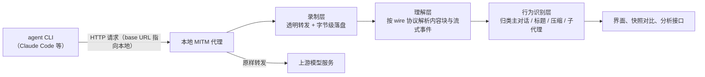
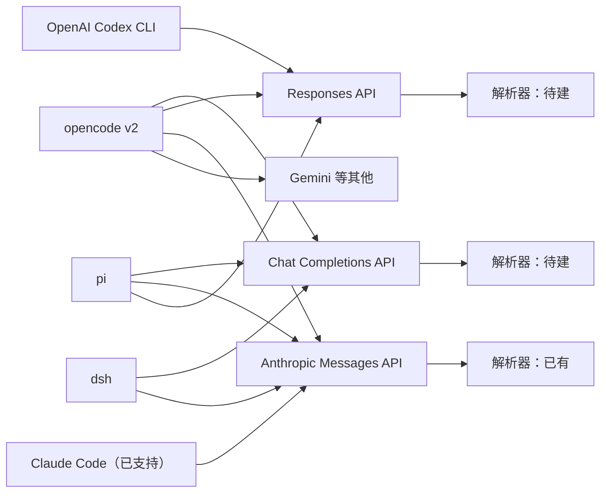

# 多 Agent CLI 接入可行性调研

| 项 | 内容 |
|---|---|
| 状态 | 调研完成，方向未拍板 |
| 日期 | 2026-09-19 |
| 调研对象 | OpenAI Codex CLI、opencode v2、DeepSeek Harness（dsh）、pi |
| 调研方式 | 开源源码与官方文档的静态核对，辅以本机已安装版本的只读检查；未做实际抓包验证 |
| 姊妹问题 | 本工具当前只解析 Anthropic Messages 格式，本调研回答「扩展到其他 agent CLI 需要什么」 |

## 摘要

- 四个调研对象的 harness 层行为高度相似：标题生成、上下文压缩、子代理派生、系统提示拼接这四件事家家都有，差别只在各自的实现细节。
- 四个对象全部提供官方支持的上游地址配置（base URL 覆盖），都可以把模型流量指到本地代理，不需要修改客户端代码。
- 在 wire 协议层面，Chat Completions API、Responses API、Anthropic Messages API 三种协议覆盖了四个对象的绝大多数配置；本工具已有 Anthropic Messages 解析器，补两个 OpenAI 系解析器即可覆盖主流场景。
- 主要技术障碍有两个：OpenAI Codex CLI 与 pi 在订阅模式下默认优先使用 WebSocket 传输；pi 的部分链路对请求体使用 zstd 压缩。两者都有已知的规避配置，但均未经实测。
- pi 在使用 Claude 订阅 OAuth 鉴权时，会在 wire 上伪装成 Claude Code 客户端；这意味着现有的 Anthropic Messages 解析器很可能无需改动即可解析这部分流量。

## 背景与目的

- 本工具目前的定位是 Claude Code 专用的链路级流量分析器：把 `ANTHROPIC_BASE_URL` 指到本地代理，透明录制 Claude Code 与上游的全部 HTTP 请求和响应。
- 录制层（代理转发）本身与格式无关，任何 HTTP 流量都能录下来；但理解层（内容块解析、流式聚合、行为分类）是按 Anthropic Messages API 的格式实现的。
- 用户提出问题：如果补充 OpenAI 的两种协议格式，是否可以用同一套「代理录制 + 格式解析 + 行为识别」的方法监控其他 agent CLI，从而避免对每个客户端做侵入式改造。
- 本调研选取四个有代表性的 agent CLI，逐一回答三组问题：它用什么 wire 协议、能否把上游指到本地代理、它的 harness 行为在 wire 上长什么样。

## 调研范围与方法

- 调研对象是四个开源 agent CLI：OpenAI Codex CLI、opencode v2、DeepSeek Harness（启动命令 `dsh`）、pi。
- 结论来自三方证据的交叉核对：GitHub 源码、官方文档、本机已安装版本的只读检查（配置文件结构、命令行帮助）。
- 遵守只读纪律：没有启动任何 agent 会话，没有抓取真实流量，没有修改任何配置。
- 因此全部结论属于静态核对结果；每条带有「未实测」标记的项，都需要后续用真实流量验证。
- 版本与时效：核对发生在 2026-09-19；各对象版本见对应小节。这四个项目迭代都很快，字段名与协议细节可能随版本变化。

## 术语约定

- **harness**：指 agent CLI 中包裹模型的执行框架，负责拼装系统提示、执行工具、管理上下文。这是社区已建立的叫法。
- **wire 协议 / wire 格式**：指客户端与模型服务之间 HTTP 报文的具体格式。这也是社区已建立的叫法。
- **MITM 代理（man-in-the-middle proxy）**：指位于客户端与真实服务之间、两头都冒充对方的中间程序。本工具的录制代理属于这一类。
- **SSE（Server-Sent Events）**：指 HTTP 长连接上服务器逐块推送事件的流式传输方式，模型流式响应的主流载体。
- **base URL 覆盖**：指通过配置把客户端请求的 API 根地址改指到别处（例如本地代理）。各家配置项的字面写法不同（`baseURL`、`base_url`），本文统一称为 base URL 覆盖。
- **OAuth 订阅模式**：指用 ChatGPT、Claude Pro 等订阅账号登录获得访问权的模式，与直接填 API key 的模式相对。

## 现有架构回顾

- 本工具分三层：录制层做透明转发与字节级落盘；理解层把字节解析成内容块、停止原因与用量；行为识别层再把请求归类为主对话、标题生成、上下文压缩、子代理等种类。
- 三层中只有理解层与行为识别层依赖具体格式和具体客户端；录制层与存储、界面、快照对比、分析接口都不依赖。

## 逐工具调研结果

### OpenAI Codex CLI

- 身份：OpenAI 官方开源的编码 agent，源码在 github.com/openai/codex，以 Rust 为主，Apache-2.0 协议。核对时本机版本为 0.149.0，npm 最新稳定版为 0.155.1。
- wire 协议：只使用 OpenAI Responses API 一种协议。配置 `wire_api = "chat"` 已于 2026 年 2 月移除，现在配置即报错。
- 请求形态：每个请求都携带完整对话历史（`store=false` 无状态模式），单个请求自包含，这对录制分析非常友好。
- 推理内容不可见：请求恒带 `include: reasoning.encrypted_content`，wire 上只有推理摘要（summary），推理原文以加密字段回传。
- 特殊分支：部分新模型走 responses lite 形态，把工具定义和系统提示收进 developer 角色消息，顶层 `instructions` 与 `tools` 为空。识别特征是请求头 `x-openai-internal-codex-responses-lite: true`。
- base URL 覆盖：`~/.codex/config.toml` 顶层的 `openai_base_url` 或 `[model_providers.<id>]` 段的 `base_url` 都可以改写上游地址。OAuth 订阅模式与 API key 模式都尊重这个覆盖。运行时用 `-c` 参数传入即可，不需要改文件。
- WebSocket 障碍：内置 provider 默认开启 `supports_websockets=true`，会先尝试 WebSocket 传输，失败后回落 SSE。纯 HTTP 代理会先见到一次失败的 WebSocket 升级请求。配置自定义 provider 时该开关默认关闭。
- 备用通道：`CODEX_CA_CERTIFICATE` 环境变量可以注入自定义 CA 证书，因此不改配置、走 TLS 中间人也是一种可行路径。
- harness 行为：
  - 标题生成存在，使用专用小模型与 JSON schema 结构化输出。
  - 上下文压缩有两种：本地摘要请求与远端服务端压缩，远端方式的摘要以加密内容回传。
  - 没有 count_tokens 类网络请求，token 用量取自响应事件，压缩触发靠本地估算。
  - 子代理请求带有 `x-openai-subagent` 请求头标签，标签值标明用途（review、compact、memory_consolidation 等），这对行为分类非常有利。
  - 系统提示分层注入：基础提示走顶层 `instructions` 参数或 developer 消息，AGENTS.md 以带包裹标记的 user 消息进入历史。
- 官方背书：仓库自带一个只转发 Responses 端点的录制代理（`codex-responses-api-proxy`），官方文档演示了把客户端指向它。「代理录制」这条路线本身被官方认可。

### opencode v2

- 身份：Anomaly 公司（原 sst 组织）的开源编码 agent，源码在 github.com/anomalyco/opencode，TypeScript 项目。核对时本机版本为 v2.0.8。
- wire 协议：按 provider 而定，同一工具下多种并存。模型目录里有 222 个 provider：大多数走 Chat Completions API（含智谱编码套餐、DeepSeek、OpenRouter 等），少数走 Responses API、Anthropic Messages API、Gemini 或 Bedrock Converse。
- 版本过渡期注意：v2 正在从 Vercel AI SDK 迁移到自研 LLM 层，新旧两套配置键在当前版本并存；旧写法在 v2.0.8 上仍正常工作，新写法的完整行为未逐项验证。
- base URL 覆盖：`opencode.json` 的 `provider.<id>.options.baseURL` 是官方一等能力，源码注释明确支持「经代理或网关路由」的场景。OAuth 模式只影响 token 获取，模型请求端点仍可被覆盖。
- harness 行为：
  - 标题生成存在，且 wire 特征极易识别：system 为空、不带工具、首条消息是固定的「Generate a title for this conversation」句式。
  - 上下文压缩存在，使用固定的结构化模板（目标、细节、工作状态等小节），是主对话之外的独立请求。
  - 没有 count_tokens 类网络请求，上下文管理用本地估算。
  - 子代理通过 task 工具实现，每次调用创建独立会话；结果以带任务标记的文本回传主会话。
  - 系统提示按环境、AGENTS.md、MCP 说明、技能清单的顺序拼成数组随请求发送。
- 唯一的非 HTTP 链路是个别 provider（GitLab Duo）走 WebSocket，属于边缘场景。

### DeepSeek Harness（dsh）

- 身份：DeepSeek 官方开源的 agent CLI，启动命令 `dsh`，源码在 github.com/deepseek-ai/deepseek-harness，TypeScript 插件化架构，处于 developer preview 阶段（官方明确警告会有破坏性变更）。核对时本机版本为 0.1.5-rc.1。
- wire 协议：双适配器并存。自家 DeepSeek 路由直接使用 Chat Completions 兼容格式（含 `reasoning_content` 思考字段与 `[DONE]` 哨兵）；其余 provider 经 pi-ai 库路由，支持包括 Anthropic Messages、Chat Completions、Responses 在内的十种 api 类型。
- base URL 覆盖：`settings.yaml` 的 `providers.<route>.baseURL` 可以把任意路由指到本地代理。配置在每次请求前重读，改完下一条请求即生效，无需重启。DeepSeek 路由另认 `DEEPSEEK_BASE_URL` 环境变量。
- OAuth 路由的覆盖属于合理推断，未实测。
- harness 行为：
  - 标题生成存在，识别特征是紧随首条用户消息的极小请求（max tokens 约 64）。
  - 上下文压缩叫 condensation，同样是一次独立的摘要请求。
  - token 计数纯本地实现，基于会话日志重放估算，不发网络请求。
  - 子代理在进程内派生，与父请求共用同一路由；wire 上表现为同一凭据下并行的另一条独立消息流。
  - 系统提示有一种 DeepSeek 特有模式：系统提示变更时追加到消息历史尾部而不是重写头部的 system 消息，这是为配合 KV cache 的做法；监控端会看到 system 内容出现在消息尾部。
  - 图片链路（DeepSeek 路由）先经 Files API 上传拿文件引用，失败时整请求重建为 base64 内联。
- 注意：npm 上存在一个同名但无关的 `dsh` 包，检索时不要混淆。

### pi

- 身份：earendil-works 组织（负责人 Mario Zechner，libGDX 作者）的开源极简编码 agent，源码在 github.com/earendil-works/pi，TypeScript 项目。核对时本机版本为 0.84.1。
- wire 协议：经 pi-ai 统一抽象层支持十种 api 类型，覆盖 Anthropic Messages、Chat Completions、Responses、Gemini、Bedrock 等。
- base URL 覆盖：`~/.pi/agent/models.json` 的 `providers.<id>.baseUrl` 是官方一等能力，官方文档的示例场景就是「把现有 provider 经代理重定向」。OAuth 订阅模式同样走覆盖后的地址。
- 关键发现：pi 在使用 Claude 订阅 OAuth 鉴权时会在 wire 上伪装成 Claude Code——使用同一个 OAuth client id、同样的 `anthropic-beta` 请求头，并把工具名改写成 Claude Code 的大小写规范。这部分流量用现有的 Anthropic Messages 解析器很可能直接可解析，只是行为分类会把它们误标成 Claude Code。
- WebSocket 与压缩障碍：pi 在使用 Codex 订阅时默认先尝试 WebSocket，SSE 回退路径的请求体是 zstd 压缩。源码里有强制 SSE 的配置项，但未实测。
- OAuth 刷新流量钩不住：授权与刷新 token 的端点是源码常量，不受 base URL 覆盖影响；这只影响刷新请求的录制，不影响模型请求。
- harness 行为：
  - 没有标题生成，没有 count_tokens 请求，子代理不是内置能力（官方示例用扩展起独立进程实现）。
  - 上下文压缩存在，是一次独立的摘要请求，system 提示是固定的指纹句。
  - 工具默认并行执行，与 Codex CLI 新模型的强制串行形成对照。

## 横向对比

### wire 协议覆盖

- 三种主流协议（Chat Completions、Responses、Anthropic Messages）覆盖四个对象的绝大多数配置。
- Gemini 与 Bedrock 属于少数路径，可以留到有实际需求时再补。

### base URL 覆盖能力

| 对象 | 配置位置 | OAuth 模式下是否生效 | 即时性 |
|---|---|---|---|
| OpenAI Codex CLI | config.toml 的 `openai_base_url` / `model_providers.<id>.base_url` | 生效（静态核对） | 需重启或用运行时参数 |
| opencode v2 | opencode.json 的 `provider.<id>.options.baseURL` | 生效（源码无鉴权分支） | 需重启 |
| dsh | settings.yaml 的 `providers.<route>.baseURL` | 未实测（推断生效） | 每请求重读，改完即生效 |
| pi | models.json 的 `providers.<id>.baseUrl` | 生效（源码核对） | 需重启 |

### harness 行为对比

| 行为 | Claude Code | Codex CLI | opencode v2 | dsh | pi |
|---|---|---|---|---|---|
| 标题生成 | 有 | 有 | 有 | 有 | 无 |
| 上下文压缩（独立摘要请求） | 有 | 有（另含远端加密压缩） | 有 | 有 | 有 |
| count_tokens 网络请求 | 有 | 无 | 无 | 无 | 无 |
| 子代理 | 有（Task 工具） | 有（带请求头标签） | 有（task 工具） | 有（进程内） | 无（扩展实现） |
| 系统提示拼接 | 单 system 块 + 提醒注入 | 分层注入（instructions/developer/user） | 数组拼接 | 拼接 + 尾部追加模式 | 单字符串 + 包裹标记 |

- 对比结论一：压缩与标题生成是四家共有的 wire 可识别行为，识别方法都是「固定模板句或特征参数的小请求」。
- 对比结论二：count_tokens 探测是 Claude Code 独有的习惯，其余四家都用本地估算；迁移时这套分类直接跳过即可。
- 对比结论三：子代理在 wire 上都表现为同一凭据下并行的独立消息流，本工具现有的泳道（lane）模型可以直接沿用，各家的识别签名不同。

## 可行性评估

- 录制层：零改动。现有代理是 catch-all 透明转发，与格式无关，把任何一个对象的 base URL 指过来即可录制。
- 存储与界面层：基本复用。捕获列表、请求详情、时序图、快照对比、分析接口都围绕「一条请求-响应记录」工作，不依赖具体格式。
- 理解层：需要新增两个解析器，分别对应 Chat Completions API 与 Responses API。两个协议的语义元素与 Anthropic Messages 几乎一一对应（tool_calls 对应 tool_use、function 定义对应 tools、reasoning 对应 thinking），内部数据模型可以映射。参考实现已经存在：四个对象的开源代码里都有完整的 SSE 事件处理逻辑可供对照。
- 行为识别层：每个客户端一本「行为识别规则」，但每本都很薄，且约一半词条是共享概念（压缩等于独立摘要请求、标题等于极小请求）。pi 伪装 Claude Code 的发现意味着它的 Anthropic 流量可能连行为识别都能部分复用。

## 风险与未验证项

- WebSocket 传输：Codex CLI 内置 provider 与 pi 的 Codex 订阅模式默认优先 WebSocket。HTTP 代理会先见到一次失败的升级请求再等来 SSE 回退；能否稳定工作未实测。规避方向是配置自定义 provider 或强制 SSE，均未实测。
- zstd 请求体压缩：pi 的 Codex 订阅 SSE 路径请求体带 zstd 压缩，代理需要解压后才能解析。未实测。
- OAuth 刷新流量不可录制：pi 与 Codex CLI 的授权端点是源码常量。这只影响刷新请求，不影响模型请求。
- 推理内容加密：Codex CLI 的推理原文以加密字段回传，监控端只能看到摘要。这是协议设计使然，不是实现缺陷，无法绕过。
- 版本时效风险：四个项目迭代都很快，dsh 处于 developer preview 并明确警告破坏性变更；本调研的字段名与行为签名以 2026-09-19 的版本为准，过期后需重新核对。
- 静态核对的局限：全部 wire 结论来自源码与文档阅读，未经真实流量验证。下一步的实测（见下节）应优先于任何编码工作。
- 产品定位影响：接入多客户端意味着工具从「Claude Code 专用」走向「通用 agent 观测」，名称与 README 的口径需要同步调整。

## 结论与建议的下一步

- 结论：用「补充两个 OpenAI 系解析器 + 每客户端一套行为识别规则」的方式接入这四个对象，技术上是可行的，工作量集中在理解层与行为识别层，录制与界面层几乎白拿。
- 建议的第一步是零成本实测，先于任何编码：挑一个对象（推荐 pi 或 opencode，配置最顺），把它的一条 provider 路由指到现有代理上，录制一轮真实会话，观察 catch-all 录制与现有界面缺什么。实测结果应反过来定义两个新解析器的需求，而不是对着 API 文档闭门写。
- 实测 Codex CLI 前要先配自定义 provider 关闭 WebSocket，否则第一轮录制会只见到失败升级。
- 实测 pi 时优先用 Anthropic Messages 路由，验证「伪装成 Claude Code」的流量能否被现有解析器直接消化。

## 参考资料

- [openai/codex 源码仓库](https://github.com/openai/codex)
- [openai/codex 移除 chat wire_api 的讨论](https://github.com/openai/codex/discussions/7782)
- [anomalyco/opencode 源码仓库](https://github.com/anomalyco/opencode)
- [opencode v2 provider 文档](https://opencode.ai/v2/docs/providers/)
- [opencode 配置 schema](https://opencode.ai/config.json)
- [deepseek-ai/deepseek-harness 源码仓库](https://github.com/deepseek-ai/deepseek-harness)
- [earendil-works/pi 源码仓库](https://github.com/earendil-works/pi)
- pi 的 provider 与自定义 provider 文档随 npm 包分发（@earendil-works/pi-coding-agent 的 docs 目录）。
- dsh 的 README 与各插件说明随 npm 包分发（@deepseek-ai/dsh 及 ~/.dsh/profiles 下的子包）。
